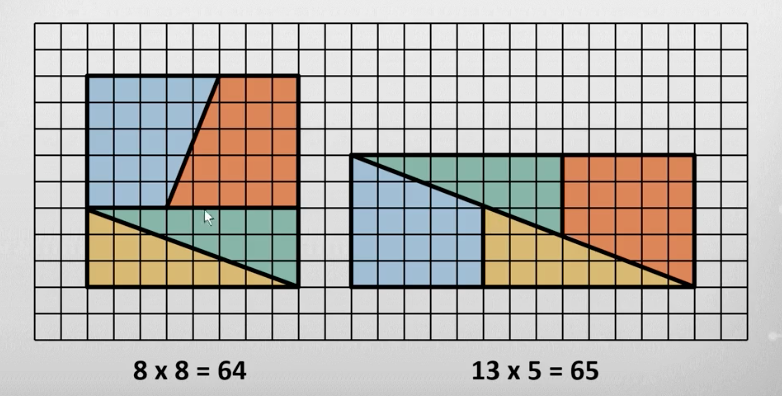

Data Mining

University of Illinois at Urbana-Champaign


## Data Visualization

实质上还是将数据通过SVG方式，放到html中展现出来。


### 2-D Graphics

一些概念：

Visualization 的模式：

1. Interactivate Visualization： 交互式的
2. Presentation Visualization： PPT
3. 还有一种介于二者之间： Interactive Storytelling： 以交互的方式用数据说一个故事。

2D-Graphics

- Vector Graphics： 矢量图
  - Low memory
  - Easy to draw line
- Raster Graphics： 像素图
  - GIF，JPG
  - High memory： 每个像素都有值
  - Hard to draw line

Canvas Coordinates 画布坐标系
Screen Coordinates 屏幕坐标系

#### SVG

参考 <https://www.w3schools.com/graphics/svg_intro.asp>

SVG stands for Scalable Vector Graphics.  可伸缩矢量图
SVG defines vector-based graphics in XML format.

SVG的标准形式：

```html
<svg width=pw height=ph viewbox="x y w H"> ... </svg>
```

- width, height 表示屏幕坐标系的尺寸大小
- viewbox，重新定义 SVG（canvas）的坐标系范围。比如 "0 0 1 1" ，就是大小为1x1的坐标系。

SVG的一些用法：

##### 嵌套

```html
<svg width=... height=... viewbox="0 0 1 1">
  draw axes, title and other coordinates
  <svg x="10%" y="10%" width="80%" height="80%" viewbox="0 0 1 1">
    plot the data as (x, 1-y)
  </svg>
</svg>
```

##### 画圆

```html
<svg width=... height=... viewbox="0 0 1 1">
  <circle cx=0.5 cy=0.5 r=0.4 stroke=black fill=blue/>
</svg>
```

### 3-D Graphics

不可能在屏幕上显示一个真正的 3D物体图形。 只能将3D 投影到 2D屏幕上显示。 类似于拍照片，从某个位置某个角度拍摄一个物体，类似于从某个方式投影到2-D图像上。

题外话？

- 为什么天空是蓝色的？
- 为什么太阳是黄色的？
- 为什么树叶是绿色的？

首先太阳光是白色的光（光谱：紫蓝绿黄橙红）。
大气层有 Rayleigh Scattering，散射主要蓝色光， 所以看起来是蓝色的。
由于蓝光被大气层散射，太阳光显示为黄色偏红。
绿色植物根据波长吸收太阳光（多为红光、和蓝色光），反射绿光，所以植物显示为绿色。

多年来的困惑！为什么天空是蓝色的。

### Photorealism

利用光影技术，让一张 2-D 图看上去就是一个 3-D场景。（暗示imply、fool 人类的视觉系统和认知系统）

主要有以下几种方法：

1. Occlusion 遮挡？ 一个物体遮住另一个物体，这是最强的暗示：一个物体近，另一个物体远。
2. Illumination， 光照。
    1. Diffuse illumination，弥散光照明。暗示物体表面分布质感。
    2. Specular illumination，比如物体表面反光强烈，暗示此处光滑。
3. Shadowing，可以暗示物体的相对位置
4. Perspective，透视。以大小来示意物体的远近和角度。
5. Stereopsis，还记得以前《科幻世界》背后的3D图么？ 斗鸡眼就可以看出来。主要是利用了左眼和右眼两个视觉系统组合得出的 3D效果。

### Non-Photorealism

为什么需要 Non-Photorealism？ 比如插画、解剖图。没必要用光影效果展示。 光影效果的计算比较复杂。

什么是 Non-Photorealism？ 另一种暗示方式，但不是通过光影作用，而是以一种颜色的渲染方式，做出立体感。

举个例子说明，例如斯诺克的 5号球，通体是蓝色的，光影效果可以显示明暗，但不改变颜色。 另一种显示立体感的方法是将 明暗映射到颜色变化上（明-暗， 暖色-冷色）

小结：
- Photorealistic rendering is based on the physics of light
- Non-Photorealistic(or artistic) rendering is based on psychology of perception
- Non-Photorealistic rendering is based on contours instead of surfaces
- Non-Photorealistic shading makes it easier to communicate shape without complex lighting

### Humans and visualization

来看一张经典的图形



注意第二个图是错误的，因为左边图 梯形的斜边的斜率是 2/5， 三角形的斜边的斜率是 3/8。 右边图的斜率为 5/13， 三角形与梯形短边在接合处的长度并非为3，而是 8 * 5/13 ~= 3.076， 很难看出来。

 将右边的拼成左边的样式，实际上是 (8 * 5/13, 5, 5) 的2个梯形， 以及 (8*5/13, 8) 的2个三角形，面积等于 $((8 * 5 / 13 + 5) * 5 + (8 * 5 / 13) * 8= 8*5 + 5*5 = 65$


#### Reasoning

- Deductive, 逻辑演绎， Concluding
- Inductive, 归纳， Generalizing
- Abductive, 溯因推理， Modeling
