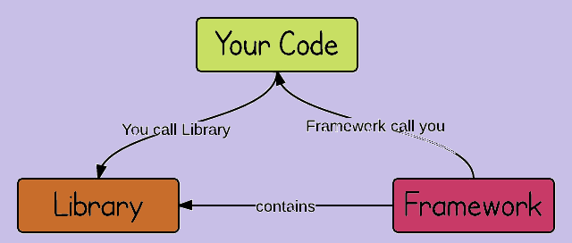
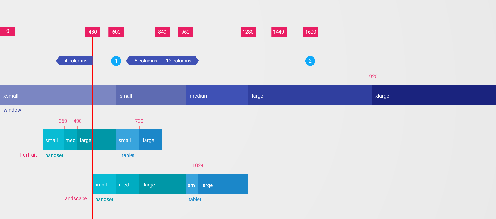

## Intro to Angular

### Library vs. Framework

参考 <https://medium.com/datafire-io/libraries-vs-frameworks-626cdde799a7> 写的很不错。

> In general, the differentiating feature is a matter of control — frameworks dictate how your project will be structured, whereas libraries are building blocks that can be used anywhere. If we use the metaphor of architecture, libraries are bricks, and frameworks are, fittingly, the frame.

Library 是砖块， Framework 就是框架




### Terms

- interpolation：  模板插入
- one-way data binding： 数据绑定
- property-binding， Component类属性可以对应到模板
- event-binding，模板事件可以调用 Component 类方法。
- DOM

> The Document Object Model (DOM) is a programming interface for HTML and XML documents. It represents the page so that programs can change the document structure, style, and content. The DOM represents the document as nodes and objects. That way, programming languages can connect to the page.


## Getting Started

参考 <https://angular.io/guide/quickstart>

### ng commands

- `ng new <project-name>`， 创建新的 project
- `ng g` 是 `ng generate` 的简写
    - `ng g class shared/<class-name>`， 在 `src/app/shared`下创建一个 类文件。
    - `ng g module <module-name>`， 在 `src/app` 下创建一个module及目录，并且自动在 app.module里导入。
    - `ng g component <component-name>`， 在 `src/app` 下创建一个 component目录， 并且自动在 app.module里引入。
    - `ng g service services/<service-name>`， 在 `src/app/services` 下创建一个 service

### Project Structure

- `main.ts`, app module 的入口
- `index.html`, 主页， 包括 header 之类，通过 `<app-root></app-root>` 包含 app主体。
- `styles.scss`, 全局样式(scss)
- `app`
    - `app/app.module.ts`, app module
        - declarations, 各种 component的声明
        - imports, module的引入
        - providers, 各种 services，用于 Dependency Injection
        - entryComponents, 入口组件： 被调用的，例如 一些 弹框。
        - bootstrap: 插入 `<app-root>` 的 root component
    - `app/app.component.ts`， `<app-root>` 根组件
    - `app/app.component.html`， 根组件对应模板。


### AppModule/AppComponent

可以定义组件，使用独立模板和样式。 组件之间可以层级调用。 非常好的组织划分方式。

这是根组件。

```javascript
import { Component } from '@angular/core';

@Component({
  selector: 'app-root',
  templateUrl: './app.component.html',
  styleUrls: ['./app.component.scss']
})
export class AppComponent {
  title = 'app';
}
```

- Component， 基础组件（装饰器?）
- selector， 选择器，主页元素。
- templateUrl， 模板位置
- styleUrls， 样式文件位置

也可以用 template， 直接定义 _inline_ 模板（如果模板不大，就几行的话），比如
```
template: `<h1> {{title} </h1>}`
```


### Directive

Directive 是 Angular 中的一个基本概念。 Component 也可以看成一个 带 Template 的 Directive。

#### Structural Directive

用于调整 DOM 结构。

- `ngIf`，  `<div *ngIf="selectDish">...</div>` ，如果有值，会插入到 DOM中。
- `ngFor`，  一种循环遍历方式，适用于列表，或者 `list` 元素
- `ngSwitch`，类似 switch 方法


#### Attribute Directive

参考 <https://angular.io/guide/attribute-directives>

它的主要作用是通过属性为元素添加一些特性（功能）。


### Angular Pipe

在模板文件中，可以 用 一些 `|` ，来对数据进行简单处理。例如 : `{{ name | uppercase }}`， 就是大写处理。


## Angular Material

Angular 与 Bootstrap 的 JQuery Component 还有一些冲突，所以避免使用 Bootstrap UI Framework。

取而代之，可以用： Angular Material Framework

参考 <https://material.angular.io/guide/getting-started>

1. `npm install --save @angular/material @angular/cdk`
2. `npm install --save @angular/animations` 动画效果
3. `npm install --save hammerjs`  手势

### Flex Layout

参考 <https://github.com/angular/flex-layout/wiki/Responsive-API>



| breakpoint | mediaQuery |
|--------|--------|
| xs    | 'screen and (max-width: 599px)'                         |
| sm    | 'screen and (min-width: 600px) and (max-width: 959px)'  |
| md    | 'screen and (min-width: 960px) and (max-width: 1279px)' |
| lg    | 'screen and (min-width: 1280px) and (max-width: 1919px)'|
| xl    | 'screen and (min-width: 1920px) and (max-width: 5000px)'|
|       |                                                         |
| lt-sm | 'screen and (max-width: 599px)'                         |
| lt-md | 'screen and (max-width: 959px)'                         |
| lt-lg | 'screen and (max-width: 1279px)'                        |
| lt-xl | 'screen and (max-width: 1919px)'                        |
|       |                                                         |
| gt-xs | 'screen and (min-width: 600px)'                         |
| gt-sm | 'screen and (min-width: 960px)'                         |
| gt-md | 'screen and (min-width: 1280px)'                        |
| gt-lg | 'screen and (min-width: 1920px)'                        |
<br/>


注意与 bootstrap的 breakpoints 还不一样。
这里 960px 以下都算小设备 （sm）。。。。 bootstrap 是 768px。

### fxLayout 和 fxLayoutAlign

`fxLayout` 定义排列方式， 参考 <https://github.com/angular/flex-layout/wiki/fxLayout-API> ，定义排列方式，主要有 row、column 以及相应倒序，共四种。

如果加上 `wrap`， 则表示可以换行。

`fxLayoutAlign` 这个是对齐方式， 包括 main axis 和 cross axis(optional)， 参考 <https://github.com/angular/flex-layout/wiki/fxLayoutAlign-API>

  举个例子：

```html
<div fxLayout="row" fxLayoutAlign="center center">
  <div>1. One</div> <div>2. Two</div> <div>3. Three</div> <div>4. Four</div>
</div>
```

主轴是横轴，交叉轴是纵轴。 对齐方式首先是 水平居中，然后是 垂直居中。


## Angular Data-Binding

这是 Data 与 View 之间必须存在的一个关系， 二者是强耦合的。

数据流可以是单向的，从 Data数据库 流向 View，也可以是双向的： 一种交互：添加、编辑数据。

有很多概念提出来，就是为了降低 Data 与 View 之间的耦合度。 比如 reflux， 指明数据必须单向流动。

Angular的 data binding包括以下几种：


左边是 DOM，是 view；  右边是 Component，是数据源（可以通过api从backend取）。

在 Component 里定义  property；在模板中可以这样写：

| component | template | 意义    |
| :------ | :---- | :----|
| `property: type = value` | `{{ value }}`| Data ----> View，单向 |
| `property: type = value` | `<app-sub-component [sub-property] = "value" />`| Data ----> View，单向， 向子组件传入数据 |
| `handler` | `(event) = "handler" `|  Data <---- View， 单向 |
| `property` | `[(ng-model)] == "property"` | Data <----> View， 双向|

注意第二种写法向子组件传入数据，一定要注意在 子组件的 Component 定义中， 将需要给传入的数据变量添加 `Input()` 装饰器。


## Angular Service

### MVC 和 MVVM

两种很经典的 Design Pattern。 所谓 Pattern，就是套路。 遇到什么问题，按照什么套路解决就可以了。

MVC 有三个部分： Model、View、Controller，各司其职。 但MVC并不是最好的pattern， MVC三个部分之间的耦合度还是太高了： Model受 View 和Controller同时调用， 还向 View输出数据； View 从 Controller和 Model获取数据。。。等等。 单纯用 MVC反而不会降低程序设计的复杂度。

感觉上，程序员主要在做的一件事情，就是降低整个系统的复杂程度，提高其容错性、易用性和重用性。（简单来说，就是让世界变得简单。。。但实际上还是在越来越复杂，如果不加限制，就会自我毁灭）

如何降低这种复杂性？就是去除系统之间部件的关联性，这种关联性就是耦合度。

MVVM 是 MVC的进一步简化： Model View View-Model， 去掉了Controller， 用 View-Model 替代。


这里 View 只与 ViewModel 完成数据绑定（data-binding）。 ViewModel 与 Model产生数据交互。


### Dependency Injection

> In software engineering, dependency injection is a technique whereby one object (or static method) supplies the dependencies of another object. A dependency is an object that can be used (a service). An injection is the passing of a dependency to a dependent object (a client) that would use it. The service is made part of the client's state.[1] Passing the service to the client, rather than allowing a client to build or find the service, is the fundamental requirement of the pattern.

主要是这句话： **Passing the service to the client, rather than allowing a client to build or find the service, is the fundamental requirement of the pattern.**  就是不要让client去找 server， 而是把 server 注入到 client 中。

如果一个对象 A 依赖另一个对象 B， 常规思路是什么？就是在 A 需要B的时候创建 B，然后使用 B。 这种做法被诟病的地方是： **这种依赖关系被 A 隐藏了。**

所谓依赖注入是指， 在创建A时（或者创建A之后），将 B 传递给 A。 A 只需要知道接口即可， 就可以任意使用。 B成为 A的一部分。_The service is made part of the client's state._ 这种好处就是 依赖关系外部可见：我创建了 A、B， 我知道 A 需要依赖 B。把 B 传给 A好了。 **主要将创建B的职责从 A 中剥离了**

个人感觉这种 依赖注入 还是面向接口编程的一种。名字取得高大上，实际上做的事情非常简单。


参考

- <https://en.wikipedia.org/wiki/Dependency_injection>


### Angular Service

Angular Service主要就是实现了这种依赖注入的概念。定义 Service， 然后将 Service 注入到 组件（Component）中。

基础使用：

- `ng generate service services/dish`， 会创建一个 Angular Service
- 在 services/dish.ts 里面可以写一些接口方法。
- 在 app.moudle 里 添加 DishService， 即可以在所有组件中注入。
- 在 Component 里 “注入” 这个 DishService 注入方式就是在 constructor里面 添加一个 `private dishService: DishService` ，然后就可以通过 dishService 调用方法，获取数据。

表面上看，其实跟直接调用也没啥区别。 感觉只是一种形式上的要求。

## Router and Single Page Application

以前我在用 React 的时候搞过一段时间， 这些概念还是了解一点的。

所谓 Single Page Application，实际上是指 一个app 所有页面实际都在一个页面（single page）里面。 加载之后，导航切换，虽然地址看上去变了，但实际只是切换了某个组件。


### Html5 History API

参考 <https://developer.mozilla.org/en-US/docs/Web/API/History_API>

 除了可以调用 API，back 或者 forward 页面， 还可以 “Adding and modifying history entries”， 就是为历史页面添加状态。


### Router

参考 <https://angular.io/guide/router>

 可以全部在 `app.module` 里定义，但是这里建议 在单独 module中定义 router。

1. 新建module： `ng g module app-routing`
2. 在 module文件里，
    1. `import { RouterModule, Routes } from '@angular/router';`
    2. 定义 各种路径 `routes: Routes[]`。 或者单独文件定义。
    3. 除了默认导出的 `AppRoutingModule` ，还要准备一个 ： `RouterModule.forRoot(routes)`
3. 在 app.module 里：
    1. `import AppRoutingModule`
    2. 在主页模板里面，使用 `<router-outlet></router-outlet>`， 表示由routes规则定义的可替换的组件。
4. 在导航链接里使用  `routeLink`。


附： `routerLinkActive` 可以用来指明 active时添加的类，用于改样式。 参考 <https://angular.io/api/router/RouterLinkActive>


### Single Page Application: SPA


参考： https://en.wikipedia.org/wiki/Single-page_application

SPA 与传统网页的主要区别在于： 传统网页应用，无论 POST还是点击导航链接， 都刷新新的页面。 而 SPA 则只需要在最初把网页应用 download下来， 之后与服务器的交互仅通过 ajax 请求， 单纯获取数据（JSON）即可。

SPA 的挑战（Challenge）， 需要解决的问题：

1. Search Engine Optimization， 传说中的 SEO
2. Partitioning the responsibility between client and server. 划分客户端与服务器端职责。
3. Maintaining History
4. Analytics
5. Speeding up the initial page load. 加速初始页面的加载。 这个很重要。 如果应用很大， 加载速度太慢会影响用户体验。 虽然之后的切换很流畅。

总体来说， SPA更像是一个客户端应用，但是在第一次使用时，要从服务器下载所有资源 （assets）。之后就是请求数据了。


## Angular Forms

### Template Driven Forms

参考 <https://angular.io/guide/forms>

使用 模板 + Two-Way Data-binding 的方式

```html
<form novalidate #loginForm="ngForm" (ngSubmit)="onSubmit(loginForm)">
  <div class="form-group">
    <label for="name">Name</label>
    <input type="text" class="form-control" id="name"
           required
           [(ngModel)]="model.name" name="name">
  </div>
  <button type="submit" [disabled]="loginForm.form.invalid" >Login</button>
</form>
```

- 注意使用了 `[(ngModel)]="model.name"` 将 `model.name` 与这个input进行 “Two-way binding”
- `#loginForm` 是一个 Template Reference Variable， 下面有提到。
- `#loginForm="ngForm"`， 有点像为这个变量加一些属性和方法。
- `(ngSubmit)="onSubmit(loginForm)"`， 就是为 `ngSubmit` 事件添加 handler。注意 handler的参数 `loginForm`，就是 `#loginForm` 模板引用变量。 可以获取这个form的所有信息。
- 在最后提交的 button中，用到了 `loginForm.form.invalid` 这个信息来决定 disable 这个button。

> The native `<form>` element doesn't have a form property. But the NgForm directive does

#### Template Reference Variable

https://angular.io/guide/template-syntax#template-reference-variables--var-

可以在 template 里面引用 DOM 元素， 比如取某个 input 的 value。

```html
<input #phone placeholder="phone number">

<!-- lots of other elements -->

<!-- phone refers to the input element; pass its `value` to an event handler -->
<button (click)="callPhone(phone.value)">Call</button>
```

可以用于调试，例如

```html
<input type="text" class="form-control" id="name"
  required
  [(ngModel)]="model.name" name="name"
  #spy>
<br>TODO: remove this: {{spy.className}}
```

可以观察某个元素的类的变化。


#### Template Driven Validation

参考 <https://angular.io/guide/form-validation#template-driven-validation>

```html
<div class="form-group">
  <label for="name">Name</label>
  <input type="text" class="form-control" id="name"
         required
         [(ngModel)]="model.name" name="name"
         #name="ngModel">
  <div [hidden]="name.valid || name.pristine"
       class="alert alert-danger">
    Name is required
  </div>
</div>
```

注意里面 `#name="ngModel"` ， 可以给 `#name` 这个 DOM 引用，添加状态， 便于使用。

> #name="ngModel" exports NgModel into a local variable called name. NgModel mirrors many of the properties of its underlying FormControl instance, so you can use this in the template to check for control states such as valid and dirty.


### Reactive Forms

 参考 https://angular.io/guide/reactive-forms

如果认为 Template Driven Form 是自底向上构建一个Form表单，那么 Reactive Form 是自顶向下构建，也可以看成 Data Driven Form：先有数据需求，然后构建Form。

二者做的事情一样，但是视角不一样。 内部细节也有不同。

Reactive Form 三大件: FormControl / FormGroup / FormBuilder

#### ReactiveFormsModule

在使用 Reactive Form 之前，要先导入 ReactiveFormsModule 到  AppModule 里。

#### FormControl

```javascript
import { FormControl } from '@angular/forms';

export class HeroDetailComponent {
  name = new FormControl();
}
```

```html
<input class="form-control" [formControl]="name">
```

这就是最简单的一个 form。 name 作为一个 FormControl 实例 通过属性绑定 成为 input的一个属性。

#### FormGroup

```javascript
import { FormControl, FormGroup } from '@angular/forms';

export class HeroDetailComponent {
  heroForm = new FormGroup ({
    name: new FormControl()
  });
}
```

```html
<form [formGroup]="heroForm">
  <div class="form-group">
    <label class="center-block">Name:
      <input class="form-control" formControlName="name">
    </label>
  </div>
</form>
```

通常 form 包含很多 form control。 通过 `FormGroup` 组织起来


#### FormBuilder

可以用 FormBuilder 创建 FormGroup， 简化创建形式。

```javascript
import { FormBuilder, FormGroup } from '@angular/forms';
export class HeroDetailComponent3{
  heroForm: FormGroup; // <--- heroForm is of type FormGroup

  constructor(private fb: FormBuilder) { // <--- inject FormBuilder
    this.createForm();
  }

  createForm() {
    this.heroForm = this.fb.group({
      name: '', // <--- the FormControl called "name"
    });
  }
}
```

 `name: ''` 表示 FormControl 名称为 `name`， 初始值是 `''` 空字符串。


#### Validators

```javascript
import { FormBuilder, FormGroup, Validators } from '@angular/forms';

...
  this.heroForm = this.fb.group({
    name: ['', Validators.required ],
  });
...
```


## Component Interaction

 参考 https://angular.io/guide/component-interaction

Component 之间的交互。主要是层级关系中的 Parent 和 Child 组件交互。 如果是 Sibling 关系，总是可以通过 父组件 间接交互。

### \@Input + setter

数据单向传输： 从父组件到子组件， 通过属性或者数据。

- 子组件： `@Input() iii` + setter
- 父组件模板： `[iii]="property/value"`

### Parent listens for child event

- 子组件： `@Output() ooo = new EventEmitter<boolean>()` 类似一个事件发生器， 事件类型是 boolean 型。也可以是其他类。
- 在父组件模板中 ， 使用 `(ooo)="handler($event)"` 用 handler 处理。

### Parent interacts with child via local variable

- 子组件： 随意
- 父组件模板： `<child-component #child></child-component>`

就是之前的 Template Reference Variable，在父组件中就可以用 `child` 变量访问 子组件的所有属性和方法。

这样做的问题是：只能在Template中调用子组件， 在父组件类中，干瞪眼。

### Parent calls an _@ViewChild()_

ViewChild 也是一个 Angular 常用的概念

> You can use ViewChild to get the first element or the directive matching the selector from the view DOM. If the view DOM changes, and a new child matches the selector, the property will be updated.

意思就是找到第一个 match 的 DOM 元素，然后可以在父组件类中使用。

- 子组件类： `XyzComponent`
- 父组件使用： `@ViewChild(XyzComponent) child: XyzComponent`

然后可以用 child 调用子组件的所有属性和方法。 这里注意另一个概念： AfterViewInit lifecycle hook.

注意 child 对应一个实际的 DOM元素， 一定是等所有 DOM 元素： 父组件、子组件都创建完成时候， 也就是 **AfterViewInit** 及之后， 才能访问到。


关于 ViewChild，有一些参考：

- [非常详细的官方解释](https://blog.angular-university.io/angular-viewchild/)
- <https://alligator.io/angular/viewchild-access-component/>


### TODO: Parent and children communicate via a service


## Promise

> ES6: ECMAScript is a standard. While JavaScript is the most popular implementation of that standard. JavaScript implements ECMAScript and builds on top of it.

参考 <https://javascript.info/promise-basics> 解释的非常好。

如果想看中文，还有中文版的： https://github.com/iliakan/javascript-tutorial-cn/blob/master/6-async/02-promise-basics/article.md

为什么我有一种 中文说明 更好的感觉。。

### new Promise

创建一个 Promise 对象：

```js
new Promise( /* executor */ function(resolve, reject) { ... } );
```

这是创建 Promise对象的标准形式。 注意几个方面：

1. 创建 Promise 对象的时候， executor 函数是立即执行的。 之前我一直以为是异步执行的。 注意一点： 之后对 promise 的使用没有在任何地方 显式调用这个 函数。
2. resolve 和 reject 是 JavaScript 引擎自带的。我们不需要专门创建它们。 之前我一直不知道这两个东西从哪里冒出来的。

Promise 对象的状态和结果 （[States and Fates/Results](https://github.com/domenic/promises-unwrapping/blob/master/docs/states-and-fates.md)）

创建的 Promise 对象有两个内部 性质（property）

- **state** — initially “pending”, then changes to either “fulfilled” or “rejected”,
- **result** — an arbitrary value of your choosing, initially undefined.

A Promise is in one of these states:

- **pending**， initial state, neither fulfilled nor rejected.
- **fulfilled**， meaning that the operation completed successfully.
- **rejected**， meaning that the operation failed.

这些状态是互斥的（mutually exclusive states)

> We say that a promise is settled if it is not pending, i.e. if it is either fulfilled or rejected. Being settled is not a state, just a linguistic convenience.

下面看 resolve 和 reject 这两个函数做了什么事情：

- `resolve(value)` — to indicate that the job finished successfully:
    - sets **state** to `"fulfilled"`,
    - sets **result** to `value`.
- `reject(error)` — to indicate that an error occurred:
    - sets **state** to `"rejected"`,
    - sets **result** to `error`.


_小结： 创建 Promise 对象的executor 函数在创建时是立即执行的。 resolve函数 和reject函数改变 promise对象状态并设置结果。_

啰嗦的补充：

- executor 是立即执行的，其中可以有耗时的 / 异步的过程，也可以没有。
- executor 只会执行一次 resolve 或者 reject，然后 promises 的状态被改变。之后的所有的 resolve 和 reject 都会被忽略。
- 技术上来说，我们可以给 reject（就像 resolve 一样）传递任何类型的参数。但是一般推荐使用 Error 对象作为 reject 的参数（或者继承于 Error 对象）
- `state` 和 `result` 是 promises 的两个内部属性。我们并不能直接通过代码访问，但是我们可以使用 then/catch 方法来根据 state 操作 result。

### then/catch/finally

这三个方法是 Promise 原型方法

- [`Promise.prototype.then()`](https://developer.mozilla.org/en-US/docs/Web/JavaScript/Reference/Global_Objects/Promise/then)
- [`Promise.prototype.catch()`](https://developer.mozilla.org/en-US/docs/Web/JavaScript/Reference/Global_Objects/Promise/catch)
- [`Promise.prototype.finally()`](https://developer.mozilla.org/en-US/docs/Web/JavaScript/Reference/Global_Objects/Promise/finally)


如果说 promise 的 executor 是生产者， 则 then/catch 是消费者， 根据 promise对象的state，处理 result。语法：

```js
// then
p.then(onFulfilled[, onRejected]);
p.then(value => { /* fulfillment */ }, error => { /* rejection */ })

// catch
p.catch(onRejected);
p.catch(error => { /* rejection */ })
```

注意上面 的 `value` 和 `error`，就是通过 `resolve` 和 `reject` 设置的。

> A Promise in the pending status. The handler function (onFulfilled or onRejected) then gets called asynchronously (as soon as the stack is empty)

也就是说，这些处理方法本身并不是立即执行的， 是在当前的 promise settled 之后执行的，这非常像 callback 函数。

所以单写一个 `then/catch`， 与以前的 callback 看上去没什么区别。其实不然。 在以前写异步的时候，写之前就需要知道异步操作可能返回什么结果以及应当怎么处理，就是先写好 callback。 使用 promise，可以先不用考虑如何处理异步操作的结果。promise 允许我们以正常的顺序书写异步编程， 这是非常好的编程模式。

`then` 方法返回一个 Promise 对象。 这里啰嗦一些：调用 `then` 方法是立即执行的并且返回一个 Promise 对象， 但是里面的 `onFulfilled` 之类的处理方法是异步执行的。 `onFulfilled` 返回的结果 如何 与 `then` 返回的 Promise 对象联系起来？？

可以参考 MDN 文档： <https://developer.mozilla.org/en-US/docs/Web/JavaScript/Reference/Global_Objects/Promise/then>

> A Promise in the pending status. The handler function (onFulfilled or onRejected) then gets called asynchronously (as soon as the stack is empty). After the invocation of the handler function, if the handler function:
> - **returns a value**, the promise returned by then gets resolved with the returned value as its value;
> - **throws an error**, the promise returned by then gets rejected with the thrown error as its value;
> - **returns an already resolved promise**, the promise returned by then gets resolved with that promise's value as its value;
> - **returns an already rejected promise**, the promise returned by then gets rejected with that promise's value as its value.
> - **returns another pending promise object**, the resolution/rejection of the promise returned by then will be subsequent to the resolution/rejection of the promise returned by the handler. Also, the value of the promise returned by then will be the same as the value of the promise returned by the handler.

 阅读理解时 把上面的 `value` 都看成 `result = value`， 把`gets revolved`看成 `state = fulfilled` 等等。

翻译过来就是：

- handle 正常返回一个 value， 则`then` 返回的 promise： `state = fulfilled, result = value`
- handle 抛出 error， 则`then` 返回的 promise： `state = rejected, result = error`
- handle 返回一个 promise： `state = fulfilled, result = value`， 则 `then` 返回的 promise： `state = fulfilled, result = value`， 复制过来。
- handle 返回一个 promise： `state = rejected, result = error`， 则 `then` 返回的 promise： `state = rejected, result = error`， 复制过来
- handle 返回一个 pending promise： `state = pending, result = undefined`， 则 `then` 返回的promise： 等着这个handle 返回的 promise 变成 settled。。然后抄过来。

其实后三种情况可以理解成： `then` 返回的 promise 等着 `handle` 出结果， 如果 `handle` 的结果还是个 promise， 则继续等这个 promise 出结果， 最后把 state 和 result 抄过来。


### error handling

#### implicit try...catch

无论在 executor 还是在 then/catch 中的 handle 方法中， 如果 throw 了一个 Error， 都会被 promise 隐式捕获， 并且将自身状态设置为 `rejected`， 结果设置为 `error`。

例如：
```js
new Promise(function(resolve, reject) {
  throw new Error("Whoops!");
}).catch(alert); // Error: Whoops!
```

等价于：

```js
new Promise(function(resolve, reject) {
  reject(new Error("Whoops!"));
}).catch(alert); // Error: Whoops!
```

注意下面这个 ：

```js
new Promise(function(resolve, reject) {
  setTimeout(() => {
    throw new Error("Whoops!");
  }, 1000);
}).catch(alert);
```

会弹出警告么？  答案是不会。 因为 promise 的作用是设置一个定时器， 这本身没有任何错误。 定时器可以被正常设置， 所以 `catch` 中的 alert 不会被执行。 至于定时器本身抛出异常，那就不关 promise 的事情了。


### chaining

参考 ： https://javascript.info/promise-chaining

`then/catch` 将立即返回一个 promise，并且这个promise 的结果与 handle 返回的结果相关。 理解了这两点， promises chaining 就很好理解。

无非就是

- 一个promise 接另一个 promise。
- 除第一个promise之外，后面每个 promise 都有 异步执行的 handle 处理上一个 promise的结果，handle处理完之后 promise会设置自身的状态和结果。

这是一种非常优雅的异步编程模式。 如果需要计算机做 1， 2， 3 三件事情， 非常耗时（I/O任务）， 写一个 `promise(1).then(2).then(3)` 就可以了。然后 coder 和 computer 就可以干点别的什么事情了。


### resolve/reject/all/race

 这些是 Promise 类方法， 并且都返回一个 Promise 对象。

- `Promise.resolve(value)`
    - `Promise.resolve(value) = Promise(state = fulfilled, result = value)`
    - `Promise.resolve(promise) = promise`
- `Promise.reject(error)`
    - `Promise(state = rejected, result = error)`
- `Promise.race(iterable)`，竞争， 只处理（抄）最快完成或失败的 promise 的状态和结果。
- `Promise.all(iterable)`，
    - 如果所有都完成了，all 返回 的 Promise结果设置为所有完成结果的 Array
    - 如果有一个失败了，all 返回 的 Promise状态为 `rejected`， 结果为失败的 `error`。

不再详细赘述。 关于 `Promise.reject(promise)` 是什么东西，没做实验验证，猜测还是一个 promise。


### Reference


- [Promise Basics](https://javascript.info/promise-basics)， 强烈推荐
- [Promise Channing](https://javascript.info/https://javascript.info/promise-chaining)， 强烈推荐 + 1
- [MDN Promise](https://developer.mozilla.org/en-US/docs/Web/JavaScript/Reference/Global_Objects/Promiseo)， 严肃的官方文档。
- [Promise by google](https://developers.google.com/web/fundamentals/primers/promises)， 不怎么严肃的官方文档？
- [Promise for Dummies](https://scotch.io/tutorials/javascript-promises-for-dummies)， 比喻很好，但并没有解释到位。
- [Promise/A+](https://promisesaplus.com/)， 标准？？


## Reactive Programming, Observable, RxJS

ReactiveX 官网： http://reactivex.io/

> ReactiveX is a combination of the best ideas from
the Observer pattern, the Iterator pattern, and functional programming

ReactiveX 可以看做是 ： 观察者模式、 迭代器模式 和函数式编程 的一种组合。

<!-- - Iterator pattern： 将数据流（stream）/ 序列 视为逐个发出的 事件 / 信号/ 粒子 / Whatever， 使用迭代器逐个 **操作** 元素，而不是完全等所有数据准备好再统一操作。
- Observer pattern： 在观察者模式中，观察者订阅事件， 实际是将处理方法 注册到 事件通知函数里， 事件发生时逐个 "通知" 观察者处理事件。
- Functional Programming 的主要思想是，输入输出可控制可复现，只要输入确定，输出总是确定。看上去像废话，但是是核心思想。 -->


[introx.md](https://gist.github.com/staltz/868e7e9bc2a7b8c1f754) 这篇文章就下面这句话稍微解释了 Observable 是如何工作的，拿 Promise 做了个类比。

> Observable is Promise++. In Rx you can easily convert a Promise to an Observable by doing `var stream = Rx.Observable.fromPromise(promise)`, so let's use that. The only difference is that Observables are not [Promises/A+](http://promises-aplus.github.io/promises-spec/) compliant, but conceptually there is no clash. A Promise is simply an Observable with one single emitted value. Rx streams go beyond promises by allowing many returned values.

其他都是废话。

Promise 可以认为是只发射一个值的 Observable。

### Promise vs.  Observable

- https://stackoverflow.com/questions/37364973/promise-vs-observable
- https://medium.com/@mpodlasin/promises-vs-observables-4c123c51fe13， Promise才几岁就已经是 Old了。。


Promise有严格的状态定义和状态转移定义，并且限制直接访问 Promise 内部变量。 但是 Observable 并没有遵守 Promises/A+。 Observable 确实相对于 Promise 模式进行了非常大的拓展，但是其稳定性、可靠性和安全性还有待验证。


### Reference and Review

- [Marbles](http://rxmarbles.com/)， Reactive Programming 有一个非常好的图示效果，使用弹珠演示。
- Observer 模式与 Pub-Sub 模式的区别： https://hackernoon.com/observer-vs-pub-sub-pattern-50d3b27f838c
- [introrx.md](https://gist.github.com/staltz/868e7e9bc2a7b8c1f754)， github上的介绍文章，比 RxJS 星数还多。。。什么鬼。

[introx.md](https://gist.github.com/staltz/868e7e9bc2a7b8c1f754) 这篇文章， 写的也不怎么好（可能是我看不懂）。 我发现很多 js技术 文章都是各种解释表面现象， 技术多牛逼，可以干什么什么事情，关键的内部机制一笔带过， 是把人都当聪明人么： 了解内部机制的还用看你这文章？ 不了解内部机制的看的懂你这文章？ 也只能看个天花乱坠。

关于观察者模式，我用起来总是别扭的很。 观察者订阅事件， subscribe，实际上是将处理方法的控制权交到了被观察对象的手上。虽然说最后还是由自己执行， 但是写起来总是很别扭。

有的文章拿 公司（subject）招聘举例，应聘者提供个人简历（订阅事件），等待通知。 对于应聘者而言，这很被动： 万一公司把你简历扔了呢？ 应聘者一无所知。 公司的通知机制可靠么？ 应聘者也不知道。。

Pub-Sub模式，或者称 生产消费者模式， 相比观察者模式就很好。 生产者/发布者 产生消息， 消费者/订阅者 处理消息。控制权都在各自的手里。


## Angular Forms, Angular and Reactive JavaScript
