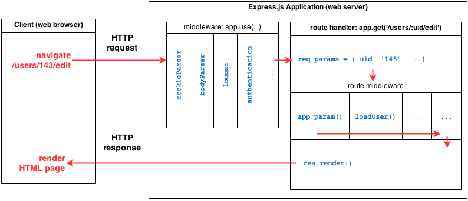

问题：

- Node.js 是什么？ 是一个 JavaScript run-time environment。
- Node.js 如何工作的？
    - 猜测是类似于浏览器的 Javascript engine。 这里用到 V8。


## Node.js

参考 <https://en.wikipedia.org/wiki/Node.js>

> Node.js is an open-source, cross-platform JavaScript run-time environment that executes JavaScript code server-side. Historically

> **JavaScript was used primarily for client-side scripting**, in which scripts written in JavaScript are embedded in a webpage's HTML and run client-side by a JavaScript engine in the user's web browser.

> Node.js lets developers use JavaScript for server-side scripting—running scripts server-side to produce dynamic web page content before the page is sent to the user's web browser.

> Consequently, Node.js represents a **"JavaScript everywhere"** paradigm,[5] unifying web application development around a single programming language, rather than different languages for server side and client side scripts.

大意：

- Node.js 是一个 javascript run-time environment。
- 过去 javascript 运行在客户端浏览器上，由 JavaScript egine运行。
- 主要为了在服务器端执行，并且返回动态网页内容。统一客户端和服务器端编程语言。。

如果拿 node.js 与 python 做比较， 二者有点相似； npm 也可以类比成 pip。

### npm (node package manager)

可以安装 package

Semantic Versioning：

- `<Major Version>.<Minor Version>.<Patch>`
    - 大版本，小版本，补丁
- 比如： `4.0.2`
- `@4.0.2` ， 精确的版本号， Exact
- `~4.0.0` ， 匹配大版本、小版本。 补丁随意
- `^4.0.0` ， 匹配大版本即可。


新的 npm(npm3) 还会产生一个 文件叫  package-lock.json 文件， 相当于将项目的所有依赖包（树） 展开平铺。

现在有一个问题： 如果某个依赖包， 版本冲突怎么办？

参考这篇文章： <https://npm.github.io/how-npm-works-docs/npm3/how-npm3-works.html>

npm3 的处理策略是： 按照安装的先后顺序，首先安装的依赖包 平铺， 后面安装出现的冲突则仍然按照以前的树结构，放到子目录 node_modules中。

进一步思考： 如果 A 依赖 B1.0， C2.0， 同时 C2.0 依赖 B2.0，这种情况下， 应该是 B1.0 在顶层， B2.0 在 C2.0 子目录中。

简而言之：如果不出现冲突则展开平铺； 出现冲突则回避冲突，将依赖包放到子目录下，形成依赖树。

这样会减少依赖冗余。


### Node Modules

Node 的一个概念

参考 ：

- https://nodejs.org/api/modules.html
- https://www.w3schools.com/nodejs/nodejs_modules.asp
- https://medium.freecodecamp.org/requiring-modules-in-node-js-everything-you-need-to-know-e7fbd119be8

注意几点：

- 每个文件是一个 module（ Each file in Node is its own module）


### Event Loops

Nodejs 是如何工作的？ 一种 non-blocking I/O 模型， 使用 callback。

参考 <https://nodejs.org/en/docs/guides/event-loop-timers-and-nexttick>

```
   ┌───────────────────────────┐
┌─>│           timers          │
│  └─────────────┬─────────────┘
│  ┌─────────────┴─────────────┐
│  │     pending callbacks     │
│  └─────────────┬─────────────┘
│  ┌─────────────┴─────────────┐
│  │       idle, prepare       │
│  └─────────────┬─────────────┘      ┌───────────────┐
│  ┌─────────────┴─────────────┐      │   incoming:   │
│  │           poll            │<─────┤  connections, │
│  └─────────────┬─────────────┘      │   data, etc.  │
│  ┌─────────────┴─────────────┐      └───────────────┘
│  │           check           │
│  └─────────────┬─────────────┘
│  ┌─────────────┴─────────────┐
└──┤      close callbacks      │
   └───────────────────────────┘
```

- 这是一个 event loop。 每个 box 对应一个 event loop 的一个 phase。
- Each phase has a FIFO queue of callbacks to execute. 每个 phase 有一个 FIFO 的 callbacks 队列。
- 每个phase中 同步执行队列中的 callbacks， 直到耗尽队列的所有 callback或者执行callbacks数量达到上限。

注意所有的异步调用，比如  `setTimeout` `setInterval` 或者 网络请求、文件读取 都是一个异步过程（参考 JavaScript），在结束后， callbacks 就绪，进入对应的 callback 队列。

#### Phases Overview

- **timers**: this phase executes callbacks scheduled by setTimeout() and setInterval().
- **pending callbacks**: executes I/O callbacks deferred to the next loop iteration.
- **idle**, prepare: only used internally.
- **poll**: retrieve new I/O events; execute I/O related callbacks (almost all with the exception of close callbacks, the ones scheduled by timers, and setImmediate()); node will block here when appropriate.
- **check**: setImmediate() callbacks are invoked here.
- **close callbacks**: some close callbacks, e.g. socket.on('close', ...).

Between each run of the event loop, Node.js checks if it is waiting for any asynchronous I/O or timers and shuts down cleanly if there are not any.

注意大部分callbacks 都是在 poll 阶段执行的。


## Modules

### http

https://nodejs.org/en/docs/guides/anatomy-of-an-http-transaction/

### fs

文件系统

## Express

Fast, unopinionated, minimalist web framework for Node.js

熟悉的味道，有点像 flask，都是轻量级的 web framework。

因为轻量，所以简单易上手。 参考 ： https://expressjs.com/en/guide/

### Routing

https://expressjs.com/en/guide/routing.html

路由系统。 与 flask 的 blueprint 概念相像。

可以直接在 app层面定义。 也可以定义一个 mini-app，也就是 express.Router，使用局部的 middlewares。


### middleware

中间件！ 又是熟悉的配方。

Middleware functions are functions that have access to the **request object (req)**, the **response object (res)**, and the next function in the application’s request-response cycle. The next function is a function in the Express router which, when invoked, executes the middleware succeeding the current middleware.

Middleware functions can perform the following tasks:

- Execute any code.
- Make changes to the request and the response objects.
- End the request-response cycle.
- Call the next middleware in the stack.

If the current middleware function does not end the request-response cycle, it must call next() to pass control to the next middleware function. Otherwise, the request will be left hanging.

Middleware 执行4个任务：

1. 任意代码
2. 修改 request对象（一般是加一些东西）， 以及 response 对象（也是加一些东西），加点料。
3. 结束 request-response cycle： 这里是指调用 res.end 方法。
4. 调用下一个 middleware

如果不结束 request-response cycle，则必须调用 next，否则就会一直挂起。

这里产生另一个问题： 什么是结束 request-response cycle？ middleware 模式的结构是如何实现的？




## MongoDB

NoSQL Database

- 首先 SQL Database 是格式化查询语言，基于 关系型数据库。非常流行，理论也比较完备。大部分网站都是用 SQL 数据库作为 backend。
- NoSQL 是 Not only SQL， 不仅仅是 SQL， 而不是对 SQL 的否定（否则就叫 NotSQL了）。

 四种主要的 NoSQL 分类：

1. Document Database， 比如 MongoDB
2. Key-Value Database， 比如 redis
3. Column-family database， 基于列存储的？ 例如 Cassandra
4. Graph Database，  例如 Neo4J


### Node + MongoDB

https://mongodb.github.io/node-mongodb-native/3.1/api/Collection.html#insert

注意参考一些文档。 注意一些操作返回的是promise（如果不指定callback的话）。

Promise 用起来就很方便。

#### Mongoose

是 ODM 层，或者叫 ORM。

一般 MongoDB 的 Document 没有结构，具有很大的灵活性。

人为添加约束，或者是 schema。

Mongoose 主要包括几个部分：

- Schema，定义约束
- Model， 基于 Schema 定义，作为数据模型层
- mongoose，用于 connect 数据库

注意几个方法：

- `mongoose.connect` 返回一个 Promise， value 为 `this` 即为 `mongoose`。 参考 <http://mongoosejs.com/docs/api.html#mongoose_Mongoose-connect>

- `Model.create()` 用于创建一个 对象，然后 `save` 到数据库，返回一个 Promise， value 为 该对象。<http://mongoosejs.com/docs/api.html#model_Model.create>

- 如果想 drop 掉 collection。 则用某个 Model 对象的 `collection.drop()` 可以直接 drop。 参考 <https://github.com/Automattic/mongoose/issues/4511>

- 如果想 close connection。 与mongodb 连接的native connection 可以从 `mongoose.connection` 获取。 参考 <https://stackoverflow.com/questions/8813838/properly-close-mongooses-connection-once-youre-done>


collection 和connection  开始给弄混了。


#### Mongoose Subdocument

参考 http://mongoosejs.com/docs/subdocs.html

可以定义 Sub Schema。  子文档的形式。 还可以通过 id 查找。


### reference

- https://scotch.io/tutorials/build-a-restful-api-using-node-and-express-4

- https://adrianmejia.com/blog/2014/10/01/creating-a-restful-api-tutorial-with-nodejs-and-mongodb/ 很棒。
