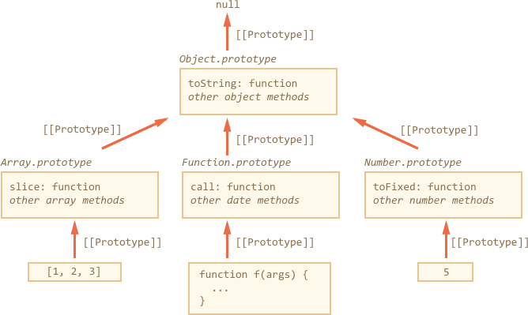

## JavaScript

https://javascript.info/


## Intro

- JavaScript was initially created as a browser-only language, but now it is used in many other environments as well.
- At this moment, JavaScript has a unique position as the most widely-adopted browser language with full integration with HTML/CSS.
- There are many languages that get “transpiled” to JavaScript and provide certain features. It is recommended to take a look at them, at least briefly, after mastering JavaScript.

### What can in-browser JavaScript do?

- Add new HTML to the page, change the existing content, modify styles.
- React to user actions, run on mouse clicks, pointer movements, key presses.
- Send requests over the network to remote servers, download and upload files (so-called AJAX and COMET technologies).
- Get and set cookies, ask questions to the visitor, show messages.
- Remember the data on the client-side (“local storage”).

### What CAN’T in-browser JavaScript do?

简单说来就是：

1. 不允许访问系统资源，除非得到许可（permission）
2. 不允许跨域访问： 为了保护用户信息安全，防止 js脚本 将用户信息发送到其他域。
3. 不存在 浏览器 tab 页面直接通信。 间接通信的方法有，比如用 cookie 或者通过服务器。

### What makes JavaScript unique?

- Full integration with HTML/CSS.
- Simple things done simply.
- Supported by all major browsers and enabled by default.


## JavaScript Fundamentals

### The modern mode, "use strict"

1. **The `"use strict"` directive switches the engine to the “modern” mode, changing the behavior of some built-in features.**
2. **The strict mode is enabled by `"use strict"` at the top. Also there are several language features like “classes” and “modules” that enable strict mode automatically.**
3. The strict mode is supported by all modern browsers.
4. It’s always recommended to start scripts with "use strict". All examples in this tutorial assume so, unless (very rarely) specified otherwise.

尽量都使用 "use strict"， 利用一些更完善的特性

### Variable

- `let` – is a modern variable declaration. The code must be in strict mode to use let in Chrome (V8).
- `const` – is like let, but the value of the variable can’t be changed.
- `var` – is an old-school variable declaration.

这里有一个类比： 变量是一个盒子， 给变量赋值就是把值装进盒子。 没装值的时候 变量是 `undefined`。

大部分语言中(例如python)， 变量都只是一个引用。每次对一个值进行引用，引用计数+1。 如果对一个值的引用没有了，这个值会被清理掉。

### Data Types

There are 7 basic types in JavaScript.

- `number` for numbers of any kind: integer or floating-point.
- `string` for strings. A string may have one or more characters, there’s no separate single-character type.
- `boolean` for true/false.
- `null` for unknown values – a standalone type that has a single value null.
- `undefined` for unassigned values – a standalone type that has a single value undefined.
- `object` for more complex data structures.
- `symbol` for unique identifiers.

The typeof operator allows us to see which type is stored in the variable.

- Two forms: `typeof x` or `typeof(x)`.
- Returns a string with the name of the type, like "string".
- For `null` returns "object" – that’s an error in the language, it’s not an object in fact.

### Type Conversion

There are three most widely used type conversions: to string, to number and to boolean.

#### ToString

Occurs when we output something, can be performed with `String(value)`. The conversion to string is usually obvious for primitive values.

#### ToNumber

Occurs in math operations, can be performed with `Number(value)`.

The conversion follows the rules:

| Value |  Becomes... |
|-------|-------------|
|`undefined`|`NaN`|
|`null`|`0`|
|<code>true&nbsp;/&nbsp;false</code> | `1 / 0` |
| `string` | The string is read "as is", whitespaces from both sides are ignored. An empty string becomes `0`. An error gives `NaN`. |

#### ToBoolean

Occurs in logical operations, or can be performed with `Boolean(value)`.

Follows the rules:

| Value |  Becomes... |
|-------|-------------|
|`0`, `null`, `undefined`, `NaN`, `""` |`false`|
|any other value| `true` |


Most of these rules are easy to understand and memorize. The notable exceptions where people usually make mistakes are:

- `undefined` is `NaN` as a number, not `0`.
- `"0"` and space-only strings like `"   "` are true as a boolean.


### Operators

基本操作符和操作符优先级就不抄了。需要的时候上网找，用多了就熟了。

几个不常见但有用的，或者 js 特有的：

- Numeric conversion, unary `+`： 用于将字符串转成数字。
- Strict equality operator `===`： **Checks the equality without type conversion.**

#### Comparison with null and undefined

两个变量在做比较时，会对值做 Type Conversion。

类型定义多了一个 `undefined`， 就带来一堆问题。。。


##### null and undefined
```js
alert( null === undefined ); // false
alert( null == undefined ); // true,  
```

Rules:

1. `null` 和 `undefined` 这俩货彼此相等（`==`）， 与其他值都不相等。
2. **For maths and other comparisons `< > <= >=`,  Values `null/undefined` are converted to a number:**
    - `null` becomes 0
    - `undefined` becomes NaN.

##### examples

```js
alert( null > 0 );  // false   rule2: 0 > 0
alert( null == 0 ); // false   rule1: null != 0
alert( null >= 0 ); // true    rule1: 0 >= 0

alert( undefined > 0 ); // false    rule2
alert( undefined < 0 ); // false    rule2
alert( undefined == 0 ); // false   rule1
```

#### Ternary operator ‘?’

三元操作符， 常规用法是一种根据条件取值的简写。例如：

```js
let age = prompt('age?', 18);

let message = (age < 3) ? 'Hi, baby!' :
  (age < 18) ? 'Hello!' :
  (age < 100) ? 'Greetings!' :
  'What an unusual age!';
alert( message );
```

 用 if 的写法是：

```js
if (age < 3) {
  message = 'Hi, baby!';
} else if (age < 18) {
  message = 'Hello!';
} else if (age < 100) {
  message = 'Greetings!';
} else {
  message = 'What an unusual age!';
}
```

注意最好 **不要在 `?` 中写执行语句**，可读性不强。例如：

```js
(company == 'Netscape') ?
   alert('Right!') : alert('Wrong.');
```

#### Logical Operators

- `||`(OR)
- `&&`(AND)
- `!` (NOT)

注意一件事情就行了，  

- `||` 的运算如果遇到 True 就会终止， 返回 True，后面的表达式就不会计算了
- `&&` 的运算如果遇到 False 就会终止， 返回 False。

这与 python 很像。

#### Summary

- Comparison operators return a logical value.
- Strings are compared letter-by-letter in the “dictionary” order.
- **When values of different types are compared, they get converted to numbers (with the exclusion of a strict equality check `===`).**
- **Values `null` and `undefined` equal `==` each other and do not equal any other value.**
- Be careful when using comparisons like > or < with variables that can occasionally be null/undefined. Making a separate check for null/undefined is a good idea.

最后一套是建议先检查 null/undefined 然后再比较。


### Loops/ Switch


#### while /for
- `while` – The condition is checked before each iteration.
- `do..while` – The condition is checked after each iteration.
- `for (;;)` – The condition is checked before each iteration, additional settings available.

`break/continue` support labels before the loop. A label is the only way for `break/continue` to escape the nesting and go to the outer loop.

#### switch

### Functions


1. Function Declaration

```js
function sum(a, b) {
  let result = a + b;

  return result;
}
```

2. Function Expression

```js
let sum = function(a, b) {
  let result = a + b;

  return result;
}
```

3. Arrow Functions

```js
// expression at the right side
let sum = (a, b) => a + b;

// or multi-line syntax with { ... }, need return here:
let sum = (a, b) => {
  // ...
  return a + b;
}

// without arguments
let sayHi = () => alert("Hello");

// with a single argument
let double = n => n * 2;
```


4. Functions may have local variables: those declared inside its body. Such variables are only visible inside the function.
5. Parameters can have default values: `function sum(a = 1, b = 2) {...}`.
6. Functions always return something. If there’s no return statement, then the result is undefined.


#### Function naming

prefix:

- `create...`， 创建对象
- `show`
- `get`， 取一个值
- `check`， 检查，返回 boolean


## JavaScript Development

### Interaction: `alert`, `prompt`, `confirm`

基础交互。

- `alert`, shows a message.
- `prompt`, shows a message asking the user to input text. It returns the text or, if CANCEL or Esc is clicked, all browsers return null.
- `confirm`, shows a message and waits for the user to press “OK” or “CANCEL”. It returns true for OK and false for CANCEL/Esc.

### Chrome Debugging

https://javascript.info/debugging-chrome


### Code style

- https://javascript.info/coding-style
- https://google.github.io/styleguide/javascriptguide.xml


#### Ninja Code

参考： https://javascript.info/ninja-code， 都是些不好的代码习惯。

All “pieces of advice” above are from the real code… Sometimes, written by experienced developers. Maybe even more experienced than you are ;)

- Follow some of them, and your code will become full of surprises.
- Follow many of them, and your code will become truly yours, no one would want to change it.
- Follow all, and your code will become a valuable lesson for young developers looking for enlightenment.

如果这样写，这种代码以后只有自己懂。。。

### Automated testing with mocha

#### Behavior Driven Development (BDD)

BDD is three things in one: **tests** AND **documentation** AND **examples**.

BDD 核心思想就是：在 （需求 + 测试 + 文档 + 用例 + ...） 与 代码之间 快速迭代。


#### mocha

spec:

```js
describe('Array', function() {
  describe('#indexOf()', function() {
    it('should return -1 when the value is not present', function() {
      assert.equal([1,2,3].indexOf(4), -1);
    });
  });
});
```

- **Tests** guarantee that the code works correctly.
- **Docs** – the titles of `describe` and `it` tell what the function does.
- **Examples** – the tests are actually working examples showing how a function can be used.

就相当于 把 文档、测试、用例写在一起了。


## JavaScript Object

### Object

两种方式创建 Object

```js
let user = new Object(); // "object constructor" syntax
let user = {};  // "object literal" syntax
```

We can imagine an object as a cabinet with signed files. Every piece of data is stored in its file by the key. It’s easy to find a file by its name or add/remove a file.

- 对象是一个 cabinet
- 每个数据是一个文件，用键值对表示。

```js
let user = {     // an object
  name: "John",  // by key "name" store value "John"
  age: 30        // by key "age" store value 30
};
delete user.age;  // 删除一个文件
```


#### Computed properties

有时候 key 是一个变量的值， 称为 computed properties

```js
let fruit = prompt("Which fruit to buy?", "apple");
let bag = {
  [fruit]: 5, // the name of the property is taken from the variable fruit
};
alert( bag.apple ); // 5 if fruit="apple"
```

我被唬住了。。。其实就是：

```js
let fruit = prompt("Which fruit to buy?", "apple");
let bag = {};

bag[fruit] = 5;
```

#### reference

**A variable stores not the object itself, but its “address in memory”, in other words “a reference” to it.**

给变量赋值一个 object， 实际上是将 object 地址赋给这个变量，使 object 多了一个引用。

### Garbage collection

https://javascript.info/garbage-collection 解释的很好。

核心概念是： **Reachability**。 直白说，就是根据能否被访问到，决定是否清理某个对象（内存）。

算法的思路是： 从顶部（树状）遍历所有对象及其引用的对象， 并标记（mark）。 对于没有mark的对象，就是 无法访问到的对象，回收内存，清理掉。


### Symbol

`Symbol` is a primitive type for unique identifiers.

```js
let id1 = Symbol("id");
let id2 = Symbol("id");

alert(id1 == id2); // false
```
Symbols are created with `Symbol()` call with an optional description.

`Symbol` 有两个特性：

1. **Symbols are always different values**， 类似于产生一个 identifier
2. Symbolic properties do not participate in `for..in` loop. 遍历对象属性时访问不到。

`Symbol` 可以用来 "隐藏" 属性，防止被别的脚本使用。 这是因为： 1. 别的脚本无法通过创建同名的 `Symbol`来访问属性； 2. 无法通过`for..in` 看到。


### Object Method, this

- Methods can reference the object as `this`.
- The value of `this` is defined at run-time.
- When a function is declared, it may use this, but that this has no value until the function is called.
- That function can be copied between objects.
- When a function is called in the “method” syntax: `object.method()`, the value of this during the call is object.

- Please note that arrow functions are special: they have no this. When this is accessed inside an arrow function, it is taken from outside.


JavaScript 的 Method 中的 this 与 python 的 self 不一样。

1. `this` 是 unbound的： **不与对象绑定**， 在 run-time 才计算 this
2. function不是对象，没有 `this`


### Object to primitive conversion

主要用于 打印输出alert之类的， 类似 python的 `__str__` 和 `__repr__`

The object-to-primitive conversion is called automatically by many built-in functions and operators that expect a primitive as a value.

hint 是根据 context 判断得到的。有三种类型。

- "string" (for alert and other string conversions)
- "number" (for maths)
- "default" (few operators)

The specification describes explicitly which operator uses which hint. There are very few operators that “don’t know what to expect” and use the "default" hint. Usually for built-in objects "default" hint is handled the same way as "number", so in practice the last two are often merged together.

The conversion algorithm is:

1. Call `obj[Symbol.toPrimitive](hint)` if the method exists,
2. Otherwise if hint is "string"
    - try `obj.toString()` and `obj.valueOf()`, whatever exists.
3. Otherwise if hint is "number" or "default"
    - try `obj.valueOf()` and `obj.toString()`, whatever exists.

一般定义一个 `toString()` 方法就够了。


### Constructor, operator "new"

Constructor functions technically are regular functions. There are two conventions though:

- They are named with capital letter first. 首字母大写
- They should be executed only with "new" operator. 只能使用 "new" 操作符

```js
function User(name) {
  // this = {};  (implicitly)

  // add properties to this
  this.name = name;
  this.isAdmin = false;

  // return this;  (implicitly)
}

let user = new User("jack");
```

constructor function 与一般function没什么区别。 在 function上 使用 `new` 操作符可以用来创建对象。 注意一个好玩的东西， `new.target`：

```js
function User() {
  alert(new.target);
}

// without new:
User(); // undefined

// with new:
new User(); // function User { ... }
```


## Data Types

### Typeof


| Type | 	Result |
| ---- | :------ |
| Undefined | 	"undefined" |
| Null | 	"object" (see below) |
| Boolean | 	"boolean" |
| Number | 	"number" |
| String | 	"string" |
| Symbol |  (new in ECMAScript 2015)	"symbol" |
| Host |  object (provided by the JS environment)	Implementation-dependent |
| Function |  object (implements [[Call]] in ECMA-262 terms)	"function" |
| Any |  other object	"object" |


```js
// This stands since the beginning of JavaScript
typeof null === 'object';
```


### Methods of primitives

JavaScript allows us to work with **primitives (strings, numbers etc)** as if they were objects.

Here’s the paradox faced by the creator of JavaScript:

1. 对 primitive 有很多操作（比如 uppercase， split）等等
2. 但是 primitive 最好非常快和轻量（lightweight），意思是不要变成 object 那么“复杂”。

解决方法：
1. Primitives are still primitive. A single value, as desired.
2. The language allows access to methods and properties of strings, numbers, booleans and symbols.
3. When this happens, a special “object wrapper” is created that provides the extra functionality, and then is destroyed.

简单说来就四个字： 过河拆桥。当需要要用一些特殊方法时，先用一个 “object wrapper” 把它变成一个临时对象，用完之后 destroy。


### Number

All numbers in JavaScript are stored in 64-bit format IEEE-754, also known as “double precision”.

所有数字都是双精度浮点， 64bit。

### Strings

In JavaScript, the textual data is stored as strings. There is no separate type for a single character.  单字符也是 string

The internal format for strings is always **UTF-16**, it is not tied to the page encoding.

 注意 python3 字符都是  **unicode**。

- There are 3 types of quotes. Backticks` `` ` allow a string to span multiple lines and embed expressions.
- Strings in JavaScript are encoded using **UTF-16**.
- To get a character, use: [].
- To get a substring, use: slice or substring.
- To lowercase/uppercase a string, use: `toLowerCase/toUpperCase`.
- To look for a substring, use: `indexOf`, or `includes/startsWith/endsWith` for simple checks.
- To compare strings according to the language, use: localeCompare, otherwise they are compared by character codes.


### Array

The declaration:

```js
// square brackets (usual)
let arr = [item1, item2...];
```

- The call to `new Array(number)` creates an array with the given length, but without elements.

- The length property is the array length or, to be precise, its last numeric index plus one. It is auto-adjusted by array methods.
- If we shorten length manually, the array is truncated.

To loop over the elements of the array:

- `for (let i=0; i<arr.length; i++)` – works fastest, old-browser-compatible.
- `for (let item of arr)` – the modern syntax for items only,
- `for (let i in arr)` – 有一些问题， 不要用这个遍历数组。


### Array Methods

A cheatsheet of array methods:

- To add/remove elements:
  - `push(...items)` -- adds items to the end,
  - `pop()` -- extracts an item from the end,
  - `shift()` -- extracts an item from the beginning,
  - `unshift(...items)` -- adds items to the beginning.
  - `splice(pos, deleteCount, ...items)` -- at index `pos` delete `deleteCount` elements and insert `items`.
  - `slice(start, end)` -- creates a new array, copies elements from position `start` till `end` (not inclusive) into it.
  - `concat(...items)` -- returns a new array: copies all members of the current one and adds `items` to it. If any of `items` is an array, then its elements are taken.

- To search among elements:
  - `indexOf/lastIndexOf(item, pos)` -- look for `item` starting from position `pos`, return the index or `-1` if not found.
  - `includes(value)` -- returns `true` if the array has `value`, otherwise `false`.
  - `find/filter(func)` -- filter elements through the function, return first/all values that make it return `true`.
  - `findIndex` is like `find`, but returns the index instead of a value.

- To transform the array:
  - `map(func)` -- creates a new array from results of calling `func` for every element.
  - `sort(func)` -- sorts the array in-place, then returns it.
  - `reverse()` -- reverses the array in-place, then returns it.
  - `split/join` -- convert a string to array and back.
  - `reduce(func, initial)` -- calculate a single value over the array by calling `func` for each element and passing an intermediate result between the calls.

- To iterate over elements:
  - `forEach(func)` -- calls `func` for every element, does not return anything.

- Additionally:
  - `Array.isArray(arr)` checks `arr` for being an array.

Please note that methods `sort`, `reverse` and `splice` modify the array itself.

These methods are the most used ones, they cover 99% of use cases. But there are few others:

- [arr.some(fn)]()/[arr.every(fn)]() checks the array.

  The function `fn` is called on each element of the array similar to `map`. If any/all results are `true`, returns `true`, otherwise `false`.

- [arr.fill(value, start, end)]() -- fills the array with repeating `value` from index `start` to `end`.

- [arr.copyWithin(target, start, end)]() -- copies its elements from position `start` till position `end` into *itself*, at position `target` (overwrites existing).

For the full list, see the [manual](https://developer.mozilla.org/en-US/docs/Web/JavaScript/Reference/Global_Objects/Array).


### Iterables

Iterable objects is a generalization of arrays. That’s a concept that allows to make any object useable in a `for..of` loop.

#### Symbol.iterator

类似于 Symbol.toPrimitive， 可以用来定义迭代方法，类似python的 `__iter__`

```js
let range = {
  from: 1,
  to: 5
};

// 1. call to for..of initially calls this
range[Symbol.iterator] = function() {

  // 2. ...it returns the iterator:
  return {
    current: this.from,
    last: this.to,

    // 3. next() is called on each iteration by the for..of loop
    next() {
      // 4. it should return the value as an object {done:.., value :...}
      if (this.current <= this.last) {
        return { done: false, value: this.current++ };
      } else {
        return { done: true };
      }
    }
  };
};

// now it works!
for (let num of range) {
  alert(num); // 1, then 2, 3, 4, 5
}
```


### Map, Set, WeakMap and WeakSet

- `Map` -- is a collection of keyed values.

    The differences from a regular `Object`:

    - Any keys, objects can be keys.
    - Iterates in the insertion order.
    - Additional convenient methods, the `size` property.

- `Set` -- is a collection of unique values.

    - Unlike an array, does not allow to reorder elements.
    - Keeps the insertion order.

- `WeakMap` -- a variant of `Map` that allows only objects as keys and removes them once they become inaccessible by other means.

    - It does not support operations on the structure as a whole: no `size`, no `clear()`, no iterations.

- `WeakSet` -- is a variant of `Set` that only stores objects and removes them once they become inaccessible by other means.

    - Also does not support `size/clear()` and iterations.

`WeakMap` and `WeakSet` are used as "secondary" data structures in addition to the "main" object storage. Once the object is removed from the main storage, so it only stays in `WeakMap/WeakSet`, they clean up automatically.


### Object.keys, values, entries

They are supported for:
- Map
- Set
- Array (except arr.values())

### Destructuring assignment

解释一下， 这是 “解构”， 就是把一个数据结构拆分。

- Destructuring assignment allows for instantly mapping an object or array onto many variables.
- The object syntax:
    ```js
    let {prop : varName = default, ...} = object
    ```

    This means that property `prop` should go into the variable `varName` and, if no such property exists, then `default` value should be used.

- The array syntax:

    ```js
    let [item1 = default, item2, ...rest] = array
    ```

    The first item goes to `item1`, the second goes into `item2`, all the rest makes the array `rest`.

- For more complex cases, the left side must have the same structure as the right one.


### Date and time

- Date and time in JavaScript are represented with the [Date]() object. We can't create "only date" or "only time": `Date` objects always carry both.

- Months are counted from zero (yes, January is a zero month).

- Days of week in `getDay()` are also counted from zero (that's Sunday).

- `Date` auto-corrects itself when out-of-range components are set. Good for adding/subtracting days/months/hours.

- Dates can be subtracted, giving their difference in milliseconds. That's because a `Date` becomes the timestamp when converted to a number.

- Use `Date.now()` to get the current timestamp fast.


### JSON methods, toJSON

- `JSON.stringify` to convert objects into JSON.
- `JSON.parse` to convert JSON back into an object.


## Advanced working with functions

### Function binding

我们已经知道 `this` 是根据 context 实时计算的。 但有时候缺失上下文，例如下面例子：

```js
let user = {
  firstName: "John",
  sayHi() {
    alert(`Hello, ${this.firstName}!`);
  }
};

setTimeout(user.sayHi, 1000); // Hello, undefined!
```

`setTimeout`仅仅知道在 1000ms 之后执行 `user.sayHi`， 缺少了上下文 user。如果不好理解，可以将 `setTimeout(user.sayHi, 1000);` 拆成两句：

```js
let f = user.sayHi;
setTimeout(f, 1000);  // lost user context
```

解决方法是： `bind`

```js
let user = {
  firstName: "John"
};

function func() {
  alert(this.firstName);
}

let funcUser = func.bind(user);
funcUser(); // John
```

如果只用 `func` 是找不到 `this` 的，但是用  `func.bind(user)`，得到了一新的 function， 这个新的函数的中，`this = user`


## Prototype

### Property flags and descriptors

Object properties, besides a **`value`**, have three special attributes (so-called "flags"):

- **`writable`** -- if `true`, can be changed, otherwise it's read-only.
- **`enumerable`** -- if `true`, then listed in loops, otherwise not listed.
- **`configurable`** -- if `true`, the property can be deleted and these attributes can be modified, otherwise not.

分别是： 可写、可枚举、可配置。  可配置表示可以随意修改配置property 属性、删除 property。 可枚举表示可以在 loops（比如 `for..in`）中访问到。

`getOwnPropertyDescriptor` 可以获取 property的所有属性。
```js
let user = {
  name: "John"
};

let descriptor = Object.getOwnPropertyDescriptor(user, 'name');

alert( JSON.stringify(descriptor, null, 2 ) );
/* property descriptor:
{
  "value": "John",
  "writable": true,
  "enumerable": true,
  "configurable": true
}
*/
```

### Property getters and setters

property 有两种：

1. data properties， 前面定义的所有 property 都是这种。
2. accessor properties

A property can either be a “data property” or an “accessor property”, but not both.

Once a property is defined with `get prop()` or `set prop()`, it’s an accessor property. So there must be a getter to read it, and must be a setter if we want to assign it.

Sometimes it’s normal that there’s only a setter or only a getter. But the property won’t be readable or writable in that case.


```js
let obj = {
  get propName() {
    // getter, the code executed on getting obj.propName
  },

  set propName(value) {
    // setter, the code executed on setting obj.propName = value
  }
};
```

#### Accessor descriptors

So an accessor descriptor may have:

- **`get`** – a function without arguments, that works when a property is read,
- **`set`** – a function with one argument, that is called when the property is set,
- **`enumerable`** – same as for data properties,
- **`configurable`** – same as for data properties.

```js
// Error: Invalid property descriptor.
Object.defineProperty({}, 'prop', {
  get() {
    return 1
  },

  value: 2
});
```

这种是既想是 accessor property，又想配置成 data property， 会出错。


### Prototype

In JavaScript, all objects have a hidden **Prototype** property that’s either another object or null.

We can use `obj.__proto__` to access it

```js
let animal = {
  eats: true
};
let rabbit = {
  jumps: true
};

rabbit.__proto__ = animal; // (*)

// we can find both properties in rabbit now:
alert( rabbit.eats ); // true (**)
alert( rabbit.jumps ); // true
```

看到没，很像是继承。

1. 如果 `rabbit` 中没有的 property， 会从 `__proto__ = animal` 里找。 (inherit)
2. 如果有，还是用自己的。 (overwrite)
3. 在 method 里出现的 `this` ，还是根据 context 决定。谁调用是谁。


### F.prototype

JavaScript has had prototypal inheritance from the beginning. It was one of the core features of the language.

But in the old times, there was another (and the only) way to set it: to use a "prototype" property of the constructor function. And there are still many scripts that use it.

```js
let animal = {
  eats: true
};

function Rabbit(name) {
  this.name = name;
}

Rabbit.prototype = animal;

let rabbit = new Rabbit("White Rabbit"); //  rabbit.__proto__ == animal

alert( rabbit.eats ); // true
```

解释一下：

1. 每个 function 都有一个默认的 `F.prototype = { constructor: F }`， 与对象的还不一样。 当然， 这个 prototype 可以被修改。
2. 如果用 `new F()` 创建对象，会将 对象的 `__proto__` 设置为 `F.prototype`

### Native prototypes

#### Object

```js
let obj = {};
alert( obj ); // "[object Object]"
```

`{}` 创建对象， 实际上使用 `new Object()` 创建，所以 `obj.__proto__ === Object.prototype`

另一个问题： `Object.prototype.__proto__` 是什么？ 答案是 `null`


#### Array, Function, Number ....



```js
typeof Array.prototype        // object
typeof Function.prototype     // function
typeof Number.prototype       // object
```

按照 [`typeof` 的定义](https://developer.mozilla.org/en-US/docs/Web/JavaScript/Reference/Operators/typeof)， implements [[Call]] in ECMA-262 terms 的 object 称为 function。

所以 Function 的 prototype 是一个实现了 `[[Call]]` 的 object。


### Methods for prototypes


- [Object.create(proto[, descriptors])]() -- creates an empty object with given `proto` as `[[Prototype]]` (can be `null`) and optional property descriptors.
- [Object.getPrototypeOf(obj)]() -- returns the `[[Prototype]]` of `obj` (same as `__proto__` getter).
- [Object.setPrototypeOf(obj, proto)]() -- sets the `[[Prototype]]` of `obj` to `proto` (same as `__proto__` setter).
- [Object.keys(obj)]() / [Object.values(obj)]() / [Object.entries(obj)]() -- returns an array of enumerable own string property names/values/key-value pairs.
- [Object.getOwnPropertySymbols(obj)]() -- returns an array of all own symbolic property names.
- [Object.getOwnPropertyNames(obj)]() -- returns an array of all own string property names.
- [Reflect.ownKeys(obj)]() -- returns an array of all own property names.
- [obj.hasOwnProperty(key)](): it returns `true` if `obj` has its own (not inherited) property named `key`.

We also made it clear that `__proto__` is a getter/setter for `[[Prototype]]` and resides in `Object.prototype`, just as other methods.

We can create an object without a prototype by `Object.create(null)`. Such objects are used as "pure dictionaries", they have no issues with `"__proto__"` as the key.

All methods that return object properties (like `Object.keys` and others) -- return "own" properties. If we want inherited ones, then we can use `for..in`.

### Class patterns: use prototype

In JavaScript there are several well-known programming patterns to make classes even without using the class keyword. And here we’ll talk about them first.

意思是在 javascript中， 不用 `class` 关键字， 使用一些 pattern 也能创建 类。 `class` 仅仅是个语法糖（并非 js 的 core feature）

#### Functional class pattern

```js
function User(name, birthday) {
  // only visible from other methods inside User
  function calcAge() {
    return new Date().getFullYear() - birthday.getFullYear();
  }

  this.sayHi = function() {
    alert(`${name}, age:${calcAge()}`);
  };
}

let user = new User("John", new Date(2000, 0, 1));
user.sayHi(); // John, age:17
```

属性、方法，该有的都有了。 `sayHi` 是外部可见的 “public” 方法。 `calcAge` 只有内部可见，从外面无法访问。


#### Factory class pattern

```js
function User(name, birthday) {
  // only visible from other methods inside User
  function calcAge() {
    return new Date().getFullYear() - birthday.getFullYear();
  }

  return {
    sayHi() {
      alert(`${name}, age:${calcAge()}`);
    }
  };
}

let user = User("John", new Date(2000, 0, 1));
user.sayHi(); // John, age:17
```

与前者的区别就是直接返回一个 `{}` 对象

#### Prototype-based classes

Prototype-based classes are the most important and generally the best. Functional and factory class patterns are rarely used in practice.

 前两个都很少用。。

```js
function User(name, birthday) {
  this._name = name;
  this._birthday = birthday;
}

User.prototype._calcAge = function() {
  return new Date().getFullYear() - this._birthday.getFullYear();
};

User.prototype.sayHi = function() {
  alert(`${this._name}, age:${this._calcAge()}`);
};

let user = new User("John", new Date(2000, 0, 1));
user.sayHi(); // John, age:17
```

 注意两点：

1. `function User` 只用来 初始化状态。
2. 在 `User.prototype` 里添加方法。 `"_"` 前缀表示是 private的，不要随意访问和修改。 但实际上是可以访问并修改的。

注意在前两个 pattern里， `this.sayHi = function() { ... };` 每个对象的方法在创建时都重复创建一遍。。。所以相比而言， the prototypal pattern is more memory-efficient.


#### Prototype-based inheritance for classes

```js
// Same Animal as before
function Animal(name) {
  this.name = name;
}

// All animals can eat, right?
Animal.prototype.eat = function() {
  alert(`${this.name} eats.`);
};

// Same Rabbit as before
function Rabbit(name) {
  this.name = name;
}

Rabbit.prototype.jump = function() {
  alert(`${this.name} jumps!`);
};

// setup the inheritance chain
Rabbit.prototype.__proto__ = Animal.prototype; // (*****)

let rabbit = new Rabbit("White Rabbit");
rabbit.eat(); // rabbits can eat too
rabbit.jump();
```

`Rabbit.prototype.__proto__ = Animal.prototype;` 构成了 prototype chain。


## Classes

The “class” construct allows to define prototype-based classes with a clean, nice-looking syntax.

所以本质上 Class 的创建就是 基于 prototype pattern 的对象的创建。

```js
class User {
  constructor(name) { this.name = name; }
  sayHi() { alert(this.name); }
}

let user = new User("John");
user.sayHi();

// proof: User is the "constructor" function
alert(User === User.prototype.constructor); // true

// proof: there are two methods in its "prototype"
alert(Object.getOwnPropertyNames(User.prototype)); // constructor, sayHi
```

`class User {...}` 干了两件事情：

1. Declares a variable `User` that references the function named `"constructor"`.
2. 将 `constructor` 和 `sayHi` 两个函数放到 `User.prototype` 里。

注意这里： `constructor` 与 `User` 是一个东西， `User` 是这个 `constructor` 的引用。

并且 `class` 还有一些特点：

- Constructors require `new`： 意思是， `User` 必须要用 new 调用。
- Different string output，  `alert(User)` 输出可能不同，取决于 engine。
- Class methods are non-enumerable.  prototype里的 方法（也是 property）的flag都设置为： `enumerable: false` ，因为在 `for..in obj` 的时候，不希望看到这些方法。
- Classes have a default constructor() {}。 如果没有定义 constructor，有默认的。
- Classes always `use strict`。 在class 内部所有代码都是 `use strict`


### Getters/setters

 在类里面定义 `get/set` 方法，相当于在 prototype 里定义 properties：

```js
Object.defineProperties(User.prototype, {
  name: {
    get() {
      return this._name
    },
    set(name) {
      // ...
    }
  }
});
```

### Only methods

Javascript 不允许类里面出现 `property: value` 这样的定义，只能是 methods。

如果要放一个 所谓的 “类属性”， 直接放到 `prototype` 里：

```js
class User { }
User.prototype.test = 5;
alert( new User().test ); // 5
```

### Static methods

```js
class User {
  static staticMethod() {
    alert(this === User);
  }
}

User.staticMethod(); // true
```

实际上就是：

```js
function User() { }

User.staticMethod = function() {
  alert(this === User);
};
```

所谓静态方法，实际上就是在 `User`  （这个function） 里定义一个方法。。。。 然后就像类静态方法那样使用。。。


### Class Expression

注意 `class` 实际上是一个特殊的 function： function-with-prototype definition

所以可以返回 `class` 对象：

```js
function makeClass(phrase) {
  // declare a class and return it
  return class {
    sayHi() {
      alert(phrase);
    };
  };
}

let User = makeClass("Hello");

new User().sayHi(); // Hello
```

`makeClass` 创建一个类，实际上就是创建一个 "function-with-prototype"

### Class inheritance

```js
// Inherit from Animal
class Rabbit extends Animal {
  hide() {
    alert(`${this.name} hides!`);
  }
}
```

`extends` 用法与之前： `Rabbit.prototype.__proto__ = Animal.prototype` 是一样。

### Super

Classes provide "super" keyword for that.

- `super.method(...)` to call a parent method.
- `super(...)` to call a parent constructor (inside our constructor only).

**Arrow functions have no `super`**

If accessed, it’s taken from the outer function. For instance:

```js
class Rabbit extends Animal {
  stop() {
    setTimeout(() => super.stop(), 1000); // call parent stop after 1sec
  }
}
```

如果这样写是不对的：
```js
// Unexpected super
setTimeout(() => super.stop(), 1000);
```
找不到 super。 后面会解释为什么。


### Overriding constructor

下面这种写法会出错：
```js
class Animal {
  constructor(name) {
    this.name = name;
  }
  // ...
}

class Rabbit extends Animal {
  constructor(name, earLength) {
    this.name = name;
    this.earLength = earLength;
  }
  // ...
}

// Doesn't work!
let rabbit = new Rabbit("White Rabbit", 10); // Error: this is not defined.
```

对于派生类（extends functions） 的 constructor function 有个 property：`[[ConstructorKind]] = "derived"`，用来区分基类的 `constructor`

这两种 constructor 运行方式也不一样：

- 一般 constructor，运行开始时会创建一个空对象 `{}`， 作为 `this`
- But when a derived constructor runs, it doesn’t do it. It expects the parent constructor to do this job.

所以derived constructor 如果不调用 `super`，就没有 `this`


### Super: internals, `[[HomeObject]]`

如果将 `super` 理解成 `this.__proto__` 或者 ` ParentClass.prototype` 或者 `Object.getPrototypeOf(this)`（这三个都是一样的东西） ，会有一些问题：

#### `this` is context

```js
let animal = {
  name: "Animal",
  eat() {
    alert(`${this.name} eats.`);
  }
};

let rabbit = {
  __proto__: animal,
  eat() {
    // ...bounce around rabbit-style and call parent (animal) method
    this.__proto__.eat.call(this); // (*)
  }
};

let longEar = {
  __proto__: rabbit,
  eat() {
    // ...do something with long ears and call parent (rabbit) method
    this.__proto__.eat.call(this); // (**)
  }
};

rabbit.eat();  // Rabbit eats.
longEar.eat(); // Error: Maximum call stack size exceeded
```

第一个 rabbit eat，没有问题；
第二个 longEar eat，因为 始终`this === longEar` 所以无法进入到 animal 中：

- `this.__proto__ === rabit, this === longEar`
- `rabbit.eat.call(this)` === `this.__proto__.eat.call(this)` 注意这里的 `this` 仍然是 `longEar`， 所以出不去了。

#### no `this` in constructor

另一个问题是在 constructor里， 注意在调用 `super` 的时候， `this` 还不存在， 更不用说 `this.__proto__` 了


为了解决这个问题， JavaScript 为 function 设置一个特殊的 internal property： `[[HomeObject]]`

**When a function is specified as a class or object method, its `[[HomeObject]]` property becomes that object.**

如果 function 是一个类的方法或对象的方法，则其 `[[HomeObject]]` property 为这个对象。

所以 `this` 全程不改变， `super = <function/method>.[[HomeObject]].__proto__`

1. `super.eat`

```js
let animal = {
  name: "Animal",
  eat() { alert(`${this.name} eats.`); } // [[HomeObject]] === animal
};

let rabbit = {
  __proto__: animal,
  name: "Rabbit",
  eat() { super.eat(); }  // [[HomeObject]] === rabbit
};

let longEar = {
  __proto__: rabbit,
  name: "Long Ear",
  eat() { super.eat(); }  // [[HomeObject]] == longEar
};

longEar.eat(); // Long Ear eats.
```

调用链：
```js
   longEar.eat(), this === longEar
-> super.eat()
-> longEar.eat.[[HomeObject]].__proto__.eat.call(this)
-> rabbit.eat.call(this)
-> super.eat()
-> rabbit.eat.[[HomeObject]].__proto__.eat.call(this)
-> animal.eat()
-> `this.name === "Long Ear"`

```


2. constructor

这些是我猜的。 “类方法” 的 `[[HomeObject]] === C.prototype`

```js
class Animal {
  constructor(name) {  // [[HomeObject]] === Animal.prototype
    this.name = name;
  }
  eat() { alert(`${this.name} eats.`); } // [[HomeObject]] === Animal.prototype
}

class Rabbit extends Animal {
  constructor(name, earLength) { // [[HomeObject]] === Rabbit.prototype
    super(name);  // {****}
    this.earLength = earLength;
  }
  eat() { super.eat(); } // [[HomeObject]] === Rabbit.prototype
}

let rabbit = new Rabbit("White Rabbit", 10);
alert(rabbit.name); // White Rabbit
alert(rabbit.earLength);  // 10
```

一、 在constructor中， `super` 相当于 `constructor.[[HomeObject]].__proto__.constructor === Rabbit.prototype.__proto__.constructor === Animal.prototype.constructor === Animal`）， 所以 `super(name)` 相当于 `Animal(name)`，会初始化 `this` 值。

二、 在 Rabbit.eat （准确说是 `Rabbit.prototype.eat`） 中， `super` 相当于 `eat.[[HomeObject]].__proto__.eat` 即 `Animal.prototype.eat`。 `this` 始终 为 `rabbit`


所以综上：

1. “类方法” 的 `<function/class/method>.[[HomeObject]] === <function/class>.prototype` ，注意是一个对象（不是 class）
2. **`super === <function/method>.[[HomeObject]].__proto__.<function/method>`**


`[[HomeObject]]` 通过正常手段是访问不到的，但这里有篇黑科技，讲如何把这个 property 暴露出来：  <https://hackernoon.com/exposing-homeobject-e61061cbfe17>

小结一下，避免记混：

1. 所有 object 都有 **internal property：`[[Prototype]]`**， 可以用 `__proto__` 或者 `getPrototypeOf` 访问。
2. function 是实现了 **internal property `[[call]]`** 的 object
3. function 有 `prototype`。如果用 function F 创建 obj， 会将 obj 的`__proto__` 设置为 `F.prototype`
4. class = function + prototype

个人总结一下：
1. 在 javascript 里，`[[Prototype]]` 是最基本的东西，每种对象都会有，它决定了 每个 object 的 “原型” 是什么。 如果 object 里没有的东西，会尝试从其原型里获取。
    - `Object.prototype.__proto__ === null`
2. 使用 function 或者 class 创建 对象，也是为了设置对象的 `[[Prototype]]`。


### Static methods and inheritance

现在有一个问题： 定义在 `ParentClass` 里的静态方法，如何继承给 `ChildClass` ？或者换句话： `ChildClass` 如何访问 `ParentClass` 里的方法？

就像普通对象"继承"一样：

```js
ChildClass.__proto__ = ParentClass
```

注意一件事情，build-in 的 类，比如 `Date、Number、String` 之类 没有这个关系，不存在 `Date.__proto__ === Object`， 所以  `Date` 不会继承 `Object` 的静态方法。


### Summary: Class = Function + Prototype

小结一下，便于记忆：

1. `obj1.__proto__ = obj2`： obj1 中找不到的 property 可以从 obj2 中找。这是 prototype 基本规则。
2. `class C {}` `obj = new C()`：  
    - `C.prototype.constructor === C`， C 只是 constructor 的引用。
    - method 都存放到 `C.prototype` 里
    - `obj.__proto__ === C.prototype`， obj 可以使用 C中定义的 method
3. `class C extends B {}` `obj = new C()`
    - `C.prototype.constructor.[[ConstructorKind]] === "derived"`， 必须依赖父类的 constructor 创建 `this`
    - `C.prototype.__proto__ === B.prototype`
    - `C.__proto__ === B`， 可以 “继承” 静态方法
    - `obj.__proto__ === C.prototype`
    - `obj.__proto__.__proto__ === B.prototype`， 可以 “继承” 一般方法


### Class checking: "instanceof"

The algorithm of `obj instanceof Class` works roughly as follows:

1. `Class` 如果有静态方法： `[Symbol.hasInstance]`

```js
// assume anything that canEat is an animal
class Animal {
  static [Symbol.hasInstance](obj) {
    if (obj.canEat) return true;
  }
}

let obj = { canEat: true };
alert(obj instanceof Animal); // true: Animal[Symbol.hasInstance](obj) is called
```

这种视角很有意思： 它检查对象，如果实现了什么方法，就认为是自己的一个实例。。。。

2. 如果没有 `[Symbol.hasInstance]`， 则检查 `obj` 的 prototype chain 是否就是 `Class.prototype`：

```js
obj.__proto__ === Class.prototype
obj.__proto__.__proto__ === Class.prototype
obj.__proto__.__proto__.__proto__ === Class.prototype
...
```

### Mixins

举个复杂点的例子：

```js
let sayMixin = {
  say(phrase) { alert(phrase); }
};

let sayHiMixin = {
  __proto__: sayMixin, // (or we could use Object.create to set the prototype here)
  sayHi() { super.say(`Hello ${this.name}`); }, // [[HomeObject]] === sayHiMixin
  sayBye() { super.say(`Bye ${this.name}`); } // [[HomeObject]] === sayHiMixin
};

class User {
  constructor(name) { this.name = name; }
}

// copy the methods, use Mixin
Object.assign(User.prototype, sayHiMixin);

// now User can say hi
new User("Dude").sayHi(); // Hello Dude!
```

注意几点：

1. `Object.assign(User.prototype, sayHiMixin)`， 就是使用Mixin的方法： 在 prototype 里混入 sayHiMixin 中的方法
2. 注意在 Minxin 中的 方法的 `[[HomeObject]]` 以及 super调用。


## Callback, Async, EventLoop
