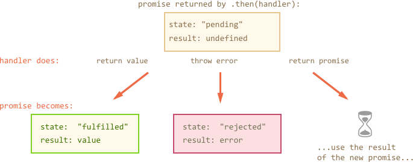

## JavaScript Advanced

一些技术专题，查漏补遗

## Closure

大名鼎鼎的闭包。

参考

- [javascript 教程](https://javascript.info/closure)
- [阮一峰：学习Javascript闭包（Closure)](http://www.ruanyifeng.com/blog/2009/08/learning_javascript_closures.html)


这里以 javascript 教程里面 关于 closure的介绍，做个笔记。

> There is a general programming term “closure”, that developers generally should know.

> A closure is a function that remembers its outer variables and can access them. In some languages, that’s not possible, or a function should be written in a special way to make it happen.

闭包（closure） 是编程的一般概念， 它是指 在 function 中可以访问外部变量。

在 JavaScript 中，通过 Lexical Environment 实现这一点。

### Lexical Environment

- 在 javascript 脚本开始执行时，有一个 Global Lexical Environment，包括这个脚本中直接声明的 variable（let/const/var），function（通过function声明）。

- 每个声明的 function 并没有立刻执行。 有一个隐藏的 `[[Environment]]` 属性，是对 outer 环境的引用，即对 Lexical Environment 的引用。

- 在 function 调用执行时， 创建一个新的 Lexical Environment（对象），这个 Lexical Environment 的 `[[Environment]]` 即外部的 Lexical Environment。

- 在 function 内部也可以继续声明 function、variable。

每个 function 在执行时使用的变量，首先从当前的 Lexical Environment找。如果找不到，从 `[[Environment]]` 引用的外部环境 找。。。 直到找到最外部的 Global Lexical Environment


同时还要注意几点：

- 每个 function 执行时创建的 Lexical Environment 是独立的，不是共享的。
- 一般情况下，函数执行完，函数创建的 Lexical Environment 就会被回收掉（参考内存回收机制，不可达，not reachable）。 但如果存在某个 变量/function 的引用， 则会保留。
- 更鸡贼的是， 在 V8 的优化中，如果发现 函数创建的 Lexical Environment 中的变量（不是函数） 没有被引用， 这些变量也会被释放掉。 这种情况可能出现在 debug 过程中。 不是 bug。


### Code blocks

不只是 function 的 `{}`， 在 JavaScript 中其他地方出现的 `{}` 都是一个新的 Lexical Environment。

#### for/while

```js
for (let i = 0; i < 10; i++) {
  // Each loop has its own Lexical Environment
  // {i: value}
}

alert(i); // Error, no such variable
```

每个 loop 都是一个新的 Lexical Environment。

#### Code Blocks

```js
{
  // do some job with local variables that should not be seen outside

  let message = "Hello";

  alert(message); // Hello
}

alert(message); // Error: message is not defined
```


### IIFE (immediately-invoked function expressions)

就是写完立即执行的函数。也不需要命名。 就是临时用一下。

```js
// Ways to create IIFE

(function() {
  alert("Brackets around the function");
})();

(function() {
  alert("Brackets around the whole thing");
}());

!function() {
  alert("Bitwise NOT operator starts the expression");
}();

+function() {
  alert("Unary plus starts the expression");
}();
```

 为什么不能直接这样写？

```js
function() {

}();
```

首先，这是个函数声明，函数声明必须要有名称。 其次，即使加上名称， 也不能在 `{}` 后面加上 `()`。

所以用一个 表达式的形式，来写 IIFE。


## Async

2018-07-03

问题： 接触javascript 时间不长，又是一堆概念，各种callback。 最近又看了 promise 和 observable，更加迷惑： javascript的异步是怎么实现的？

1. [Concurrency model and Event Loop](https://developer.mozilla.org/en-US/docs/Web/JavaScript/EventLoop)
2. [Understanding Javascript Function Executions — Call Stack, Event Loop , Tasks & more](https://medium.com/@gaurav.pandvia/understanding-javascript-function-executions-tasks-event-loop-call-stack-more-part-1-5683dea1f5ec)


到目前为止我的理解：

1. 浏览器里面 V8 引擎相当于一个 Javascript Runtime。每个页面只有一个 Javascript Runtime。 Javascript的执行是 单线程的。
2. 所有非异步过程，比如定义函数、对象、变量、执行函数之类都是在  Heap中分配空间， 按Call Stack（调用栈）中的顺序执行。
3. 一些所谓的异步过程，比如 `setTimeout`， `AJAX` 实际上调用了 Browser Web API， 比如 DOM 中的 `onclick`。 DOM 是文档模型，不是 Javascript Runtime的一部分，对 DOM 的操作不过也是底层 API 调用而已
4. 这些交给别人干的事情，异步的事情，可以“注册” callback 方法，即回调方法。 而这些异步过程在完成之后会发给消息到 Callback Queue 里。 Javascript 的 Event Loop 会循环读取这些消息， 然后将对应的 Callback 函数压入 Call Stack，开始执行。
    - 如果 DOM 的事件没有 listener， 则不会发消息到 Queue中。
    - 有的文章里提到消息和对应的 Callback实际上 是一个 Event Table。 本着职责分离的原则， 异步过程如果有listener，也只是通知一下消息。 Event Loop 在收到消息之后找到对应的 Callback 函数开始执行。


不清楚的地方有：

1. 感觉 Event Loop 是在js 的 main做完之后，也就是所有 js的 非异步过程全部执行完之后， 才开始处理这些 事件的，不过没有在哪里明确看到这一点。
    - 文章 2 有提到这一点
    - event loop 与 runtime 平级的，还是只是 runtime的一部分？

2. 更多的细节。

https://blog.carbonfive.com/2013/10/27/the-javascript-event-loop-explained/

这篇文章很老了。大概从第一张示意图可以看出来， event loop 是在 call stack 为空后开始执行的。 所以我的推测是 event loop 也是 runtime的一部分， 只要 call stack 为空就一直循环检查消息

> “Concurrency in JS— One Thing at a Time, except not Really, Async Callbacks”

> Browser Web APIs- threads created by browser implemented in C++ to handle async events like DOM events, http request, setTimeout, etc.


## Promise

> ES6: ECMAScript is a standard. While JavaScript is the most popular implementation of that standard. JavaScript implements ECMAScript and builds on top of it.

参考 <https://javascript.info/promise-basics> 解释的非常好。

如果想看中文，还有中文版的： https://github.com/iliakan/javascript-tutorial-cn/blob/master/6-async/02-promise-basics/article.md

为什么我有一种 中文说明 更好的感觉。。

### new Promise

创建一个 Promise 对象：

```js
new Promise( /* executor */ function(resolve, reject) { ... } );
```

这是创建 Promise对象的标准形式。 注意几个方面：

1. 创建 Promise 对象的时候， executor 函数是立即执行的。 之前我一直以为是异步执行的。 注意一点： 之后对 promise 的使用没有在任何地方 显式调用这个 函数。
2. resolve 和 reject 是 JavaScript 引擎自带的。我们不需要专门创建它们。 之前我一直不知道这两个东西从哪里冒出来的。

Promise 对象的状态和结果 （[States and Fates/Results](https://github.com/domenic/promises-unwrapping/blob/master/docs/states-and-fates.md)）

创建的 Promise 对象有两个内部 性质（property）

- **state** — initially “pending”, then changes to either “fulfilled” or “rejected”,
- **result** — an arbitrary value of your choosing, initially undefined.

A Promise is in one of these states:

- **pending**， initial state, neither fulfilled nor rejected.
- **fulfilled**， meaning that the operation completed successfully.
- **rejected**， meaning that the operation failed.

这些状态是互斥的（mutually exclusive states)

> We say that a promise is settled if it is not pending, i.e. if it is either fulfilled or rejected. Being settled is not a state, just a linguistic convenience.

下面看 resolve 和 reject 这两个函数做了什么事情：

- `resolve(value)` — to indicate that the job finished successfully:
    - sets **state** to `"fulfilled"`,
    - sets **result** to `value`.
- `reject(error)` — to indicate that an error occurred:
    - sets **state** to `"rejected"`,
    - sets **result** to `error`.


_小结： 创建 Promise 对象的executor 函数在创建时是立即执行的。 resolve函数 和reject函数改变 promise对象状态并设置结果。_

啰嗦的补充：

- executor 是立即执行的，其中可以有耗时的 / 异步的过程，也可以没有。
- executor 只会执行一次 resolve 或者 reject，然后 promises 的状态被改变。之后的所有的 resolve 和 reject 都会被忽略。
- 技术上来说，我们可以给 reject（就像 resolve 一样）传递任何类型的参数。但是一般推荐使用 Error 对象作为 reject 的参数（或者继承于 Error 对象）
- `state` 和 `result` 是 promises 的两个内部属性。我们并不能直接通过代码访问，但是我们可以使用 then/catch 方法来根据 state 操作 result。

### then/catch/finally

这三个方法是 Promise 原型方法

- [`Promise.prototype.then()`](https://developer.mozilla.org/en-US/docs/Web/JavaScript/Reference/Global_Objects/Promise/then)
- [`Promise.prototype.catch()`](https://developer.mozilla.org/en-US/docs/Web/JavaScript/Reference/Global_Objects/Promise/catch)
- [`Promise.prototype.finally()`](https://developer.mozilla.org/en-US/docs/Web/JavaScript/Reference/Global_Objects/Promise/finally)


如果说 promise 的 executor 是生产者， 则 then/catch 是消费者， 根据 promise对象的state，处理 result。语法：

```js
// then
p.then(onFulfilled[, onRejected]);
p.then(value => { /* fulfillment */ }, error => { /* rejection */ })

// catch
p.catch(onRejected);
p.catch(error => { /* rejection */ })
```

注意上面 的 `value` 和 `error`，就是通过 `resolve` 和 `reject` 设置的。

> A Promise in the pending status. The handler function (onFulfilled or onRejected) then gets called asynchronously (as soon as the stack is empty)

也就是说，这些处理方法本身并不是立即执行的， 是在当前的 promise settled 之后执行的，这非常像 callback 函数。

所以单写一个 `then/catch`， 与以前的 callback 看上去没什么区别。其实不然。 在以前写异步的时候，写之前就需要知道异步操作可能返回什么结果以及应当怎么处理，就是先写好 callback。 使用 promise，可以先不用考虑如何处理异步操作的结果。promise 允许我们以正常的顺序书写异步编程， 这是非常好的编程模式。

`then` 方法返回一个 Promise 对象。 这里啰嗦一些：调用 `then` 方法是立即执行的并且返回一个 Promise 对象， 但是里面的 `onFulfilled` 之类的处理方法是异步执行的。 `onFulfilled` 返回的结果 如何 与 `then` 返回的 Promise 对象联系起来？？

可以参考 MDN 文档： <https://developer.mozilla.org/en-US/docs/Web/JavaScript/Reference/Global_Objects/Promise/then>

> A Promise in the pending status. The handler function (onFulfilled or onRejected) then gets called asynchronously (as soon as the stack is empty). After the invocation of the handler function, if the handler function:
> - **returns a value**, the promise returned by then gets resolved with the returned value as its value;
> - **throws an error**, the promise returned by then gets rejected with the thrown error as its value;
> - **returns an already resolved promise**, the promise returned by then gets resolved with that promise's value as its value;
> - **returns an already rejected promise**, the promise returned by then gets rejected with that promise's value as its value.
> - **returns another pending promise object**, the resolution/rejection of the promise returned by then will be subsequent to the resolution/rejection of the promise returned by the handler. Also, the value of the promise returned by then will be the same as the value of the promise returned by the handler.

 阅读理解时 把上面的 `value` 都看成 `result = value`， 把`gets revolved`看成 `state = fulfilled` 等等。

翻译过来就是：

- handle 正常返回一个 value， 则`then` 返回的 promise： `state = fulfilled, result = value`
- handle 抛出 error， 则`then` 返回的 promise： `state = rejected, result = error`
- handle 返回一个 promise： `state = fulfilled, result = value`， 则 `then` 返回的 promise： `state = fulfilled, result = value`， 复制过来。
- handle 返回一个 promise： `state = rejected, result = error`， 则 `then` 返回的 promise： `state = rejected, result = error`， 复制过来
- handle 返回一个 pending promise： `state = pending, result = undefined`， 则 `then` 返回的promise： 等着这个handle 返回的 promise 变成 settled。。然后抄过来。

其实后三种情况可以理解成： `then` 返回的 promise 等着 `handle` 出结果， 如果 `handle` 的结果还是个 promise， 则继续等这个 promise 出结果， 最后把 state 和 result 抄过来。



### error handling

#### implicit try...catch

无论在 executor 还是在 then/catch 中的 handle 方法中， 如果 throw 了一个 Error， 都会被 promise 隐式捕获， 并且将自身状态设置为 `rejected`， 结果设置为 `error`。

例如：
```js
new Promise(function(resolve, reject) {
  throw new Error("Whoops!");
}).catch(alert); // Error: Whoops!
```

等价于：

```js
new Promise(function(resolve, reject) {
  reject(new Error("Whoops!"));
}).catch(alert); // Error: Whoops!
```

注意下面这个 ：

```js
new Promise(function(resolve, reject) {
  setTimeout(() => {
    throw new Error("Whoops!");
  }, 1000);
}).catch(alert);
```

会弹出警告么？  答案是不会。 因为 promise 的作用是设置一个定时器， 这本身没有任何错误。 定时器可以被正常设置， 所以 `catch` 中的 alert 不会被执行。 至于定时器本身抛出异常，那就不关 promise 的事情了。


### chaining

参考 ： https://javascript.info/promise-chaining

`then/catch` 将立即返回一个 promise，并且这个promise 的结果与 handle 返回的结果相关。 理解了这两点， promises chaining 就很好理解。

无非就是

- 一个promise 接另一个 promise。
- 除第一个promise之外，后面每个 promise 都有 异步执行的 handle 处理上一个 promise的结果，handle处理完之后 promise会设置自身的状态和结果。

这是一种非常优雅的异步编程模式。 如果需要计算机做 1， 2， 3 三件事情， 非常耗时（I/O任务）， 写一个 `promise(1).then(2).then(3)` 就可以了。然后 coder 和 computer 就可以干点别的什么事情了。


### resolve/reject/all/race

 这些是 Promise 类方法， 并且都返回一个 Promise 对象。

- `Promise.resolve(value)`
    - `Promise.resolve(value) = Promise(state = fulfilled, result = value)`
    - `Promise.resolve(promise) = promise`
- `Promise.reject(error)`
    - `Promise(state = rejected, result = error)`
- `Promise.race(iterable)`，竞争， 只处理（抄）最快完成或失败的 promise 的状态和结果。
- `Promise.all(iterable)`，
    - 如果所有都完成了，all 返回 的 Promise结果设置为所有完成结果的 Array
    - 如果有一个失败了，all 返回 的 Promise状态为 `rejected`， 结果为失败的 `error`。

不再详细赘述。 关于 `Promise.reject(promise)` 是什么东西，没做实验验证，猜测还是一个 promise。


### Reference


- [Promise Basics](https://javascript.info/promise-basics)， 强烈推荐
- [Promise Channing](https://javascript.info/https://javascript.info/promise-chaining)， 强烈推荐 + 1
- [MDN Promise](https://developer.mozilla.org/en-US/docs/Web/JavaScript/Reference/Global_Objects/Promiseo)， 严肃的官方文档。
- [Promise by google](https://developers.google.com/web/fundamentals/primers/promises)， 不怎么严肃的官方文档？
- [Promise for Dummies](https://scotch.io/tutorials/javascript-promises-for-dummies)， 比喻很好，但并没有解释到位。
- [Promise/A+](https://promisesaplus.com/)， 标准？？


## Observable

说实话 Promise 好理解。

但是 Observable 比较复杂，内部机制也没有明确说明。 只能通过各种文章，片面的了解 Observable。


### Learning Observable By Building Observable

终于找到了这篇文章， RxJS Lead 写的很透彻！ <https://medium.com/@benlesh/learning-observable-by-building-observable-d5da57405d87>

没看这篇文章之前，总觉得 Observable 里面各种魔法，异步同步满天飞。 如果 observer 订阅了，会怎么怎么样，没有订阅会怎么怎么样。 肯定有很神奇的机制吧。

看了这篇文章之后， 才发现 Observable 真的是没那么复杂。

> When we talk about RxJS or Reactive programming, generally **observables** get top billing. But **the observer implementation is actually the workhorse of this type of reactive programming**.

看上去 Observable 概念高大上，吸引了所有人的目光。但是实际上工作的还是 observer，正如通常的观察者模式。

#### Observer pattern

```js
const myObserver = {
  next(x) { console.log(x); },
  error(err) { console.error(err); },
  complete() { console.log('done')}
};

function subscribe(observer) {
    const datasource = new DataSource();
    datasource.ondata = (e) => observer.next(e);
    datasource.onerror = (err) => observer.error(err);
    datasource.oncomplete = () => observer.complete();
    return () => {
        datasource.destroy();
    };
}

const unsubscribe = subscribe(myObserver);
```

观察上面的代码，

- `datasource` 是一个数据源/事件源，可以是同步的，也可以是异步的。 为 `ondata` 添加一个方法 ： `（e) => observer.next(e)` 每次数据到来时处理数据。 可以看出，其实就是 observer 在干活。
- `subscribe` 这个 function 主要做了这几件事情：
    1. 创建数据源
    2. 注册方法
    3. 返回一个销毁数据源的函数

就是 观察者模式的套路。


#### Safe Observers: Make Observers Great Again

当然，写 observer 需要遵守一些规定，比如必须有 `next` `error` `complete` 处理函数。 用户懒得写怎么办？  那就用 `safeObserver` 封装一下好了。

```js
function subscribe(observer) {
  const safeObserver = new SafeObserver(observer);
  const datasource = new DataSource();
  datasource.ondata = (e) => safeObserver.next(e);
  datasource.onerror = (err) => safeObserver.error(err);
  datasource.oncomplete = () => safeObserver.complete();

  safeObserver.unsub = () => {
    datasource.destroy();
  };

  return safeObserver.unsubscribe.bind(safeObserver);
}
```

这里 `SafeObserver` 是一个类，用于创建 safeObserver 对象，提供安全的 `next, error, complete` 方法。

通过 `subscribe` 创建 `safeObserver`，与数据源绑定（观察数据源）， 返回一个 销毁数据源的函数。

#### Designing Observable: Ergonomic Observer Safety

到目前为止还没有出现 `Observable` 这个概念。

现在问： `subscribe` 的主体是谁？ 应该在什么时候调用？ 封装这个方法， 得到的概念就是 `Observable`。 换句话说，实现了 `subscribe` 方法的对象可称为 `Observable`

```js
class Observable {
  constructor(_subscribe) {
    this._subscribe = _subscribe;
  }

  subscribe(observer) {
    const safeObserver = new SafeObserver(observer);
    return this._subscribe(safeObserver);
  }
}

const myObservable = new Observable((observer) => {
    const datasource = new DataSource();
    datasource.ondata = (e) => observer.next(e);
    datasource.onerror = (err) => observer.error(err);
    datasource.oncomplete = () => observer.complete();
    return () => {
        datasource.destroy();
    };
});
```

**注意这里 `Observable` 接受一个 subscribe 方法作为参数，创建 Observable 对象。 在自己的 `subscribe` 里面， 将 observer 封装为 safeObserver。**

综上， Observable类接受一个函数参数创建 observable 对象。这个函数是一个普通的订阅函数。 在自己的 `subscribe` 方法中，接受 observer 对象参数， 并对 observer 进行封装（保护）。


#### Operators: Also Just Functions

现在来看 Observable中比较神奇的 Operators。其实也是 function。（Javascript 中所有 class 实际上都是 function）。

对 Operator 的设计期望是： 接受一个 Observable 对象作为参数，返回一个 Observable 对象。可以这么实现：

```js
const myObservable = new Observable((observer) => {
  let i = 0;
  setInterval(() => {
      observer.next(i++);
  }, 1000);
});

function map(srcObservable, project) {
  let newSubscribe = (observer) =>
    const mapObserver = {
      next: (x) => observer.next(project(x)),
      error: (err) => observer.error(err),
      complete: () => observer.complete()
    };
    return srcObservable.subscribe(mapObserver);
  };
  return new Observable(newSubscribe);

const mySecondObservable = map(myObservable)
```

上面多定义了一个 `newSubscribe` 主要是为了理解方便。

注意几点：

1. 用 `Observable` 创建对象，并没有调用 subscribe 方法，所以定时器并没有开始启动。
2. 注意 `map` 方法 也没有调用 subscribe 方法，它只是定义了一个新的 subscribe 方法，对原来的 subscribe 方法进行了封装： 在 srcObservable 与 observer 之间插入了一个 `mapObserver`，所有数据将会被 `project(x)` 之后传给 `observer`。 或者说对 `observer` 进行了封装，使传给 `observer` 的数据进行了加工。
3. `map` 方法返回一个新的 `Observable` 对象，使用封装了之后的 `newSubscribe` 方法。

下面观察 `subscribe` 调用时会发生什么。

```js
const myObserver = {
  next(x) { console.log(x); },
};

mySecondObservable.subscribe(myObserver);
```

1. mySecondObservable 会调用自己封装的 `newSubscribe` 方法， 对 `myObserver` 进行一层封装，变成 `mapObserver`，然后调用 `srcObservable.subscribe(mapObserver);`
2. 在 `srcObservable.subscribe(mapObserver)` 中启动定时器（异步）， 调用 `mapObserver` 的 `next` 方法。


这个 subscribe 过程就变成：

1. 回溯逐层封装 observer： myObserver -> mapObserver
2. 开启数据流
3. 逐层处理数据并调用下一层 observer.next 方法：`mapObserver.next(x)` -> `x = project(x)` -> `myObserver.next(x)`

综上：

1. **Operator 定义新的 subscribe 方法，这个 subscribe 方法定义了一个新的 observer，对数据进行一些处理之后再传给旧的 observer处理**。然后用这个方法作为参数创建并返回新的 Observable 对象。
2. **subscribe 先回溯封装 observer， 然后开始数据处理流。逐层调用 observer.next**


#### Designing Observable: Making Operator Chains Pretty

```js
map(map(myObservable, (x) => x + 1), (x) => x + 2);
```

如果有很多层，这种写法不怎么好看。

期望写成这样：

```js
myObservable.map(x => x + 1).map(x => x + 2);
```

只需要将 `map` 放到 `Observable.prototype` 里就可以了 ：

```js
Observable.prototype.map = function (project) {
    return new Observable((observer) => {
        const mapObserver = {
            next: (x) => observer.next(project(x)),
            error: (err) => observer.error(err),
            complete: () => observer.complete()
        };
        return this.subscribe(mapObserver);
    });
};
```

具体细节不再描述。

> NOTICE: The example Observable implementations still return functions above, where RxJS and the es-observable spec return Subscription objects.  Subscription objects are a much better design

实际 Observable 在 subscribe 之后并不返回一个销毁函数，而是返回一个 Subscription 对象。这里是为了方便说明内部机制。


### Promises vs. Observables

大部分文章会拿 Observable 与 Promise 作比较。 二者在表现形式上很相似， 但是内部机制完全是两个概念。

解读：  [Promises vs Observables]( https://medium.com/@mpodlasin/promises-vs-observables-4c123c51fe13)

注： 这篇文章是先看的，没有了解 Observable内部机制之前看的。 其实还是流于表面了。


#### Single value vs multiple values

每个 Promise 只有一个 result/value

每个 Observable 会出现很多 value， 像一个 **stream**， emit values。

```js
const numberObservable = new Observable((observer) => {
    observer.next(5);  // emit 5
    observer.next(10); // emit 10
});

numberObservable.subscribe(value => console.log(value));
```

所以：

Promise 适用于只有一个结果的 异步过程， 例如 HTTP request， `setTimeout`

但是有很多异步事件是可能有多个结果的，例如：

- `setInterval`
- webSockets
- DOM events (mouse clicks etc.)
- any kind of events, for that matter (also in Node.js).

解释一下 鼠标点击， 最常规的做法就是写 `click` 回调。

但有没有一种防止用户频繁点击或者刷新的 `click` 方法？ 采用常规做法就是 `click` 回调中设置 `timeout` 之类的。 会很麻烦。

如果把事件源想象成一个 Observable， click事件就是用户点击 button， piupiupiu发出的若干事件， 可以用 Observable 的一些 Operator（RxJS）， 来过滤、或者限流（throttle）这些事件。 写起来会很方便。

#### Eager vs lazy

promise 的 executor 是立即执行的： 比如设置个定时器，定时器也是立刻开始的。异步过程结束之后会改变 promise对象 的状态和结果。

```js
const promise = new Promise((resolve) => {       
    let i = 0;
    setInterval(() => {
        resolve(i++); // 只返回 0 这个结果
    }, 1000);
});
```

observable 如果没有调用 subscribe， 定时器不会开始执行。 lazy模式。
```js
const observable = new Observable((observer) => {       
    let i = 0;
    setInterval(() => {
        observer.next(i++);
    }, 1000);
});
observable.subscribe(value => console.log(value));
```

### Reference and Review

- [Marbles](http://rxmarbles.com/)， Reactive Programming 有一个非常好的图示效果，使用弹珠演示。
- Observer 模式与 Pub-Sub 模式的区别： https://hackernoon.com/observer-vs-pub-sub-pattern-50d3b27f838c
- [introrx.md](https://gist.github.com/staltz/868e7e9bc2a7b8c1f754)， github上的介绍文章，比 RxJS 星数还多。。。什么鬼。

[introx.md](https://gist.github.com/staltz/868e7e9bc2a7b8c1f754) 这篇文章， 写的也不怎么好（可能是我看不懂）。 我发现很多 js技术 文章都是各种解释表面现象， 技术多牛逼，可以干什么什么事情，关键的内部机制一笔带过， 是把人都当聪明人么： 了解内部机制的还用看你这文章？ 不了解内部机制的看的懂你这文章？ 也只能看个天花乱坠。

关于观察者模式，我用起来总是别扭的很。 观察者订阅事件， subscribe，实际上是将处理方法的控制权交到了被观察对象的手上。虽然说最后还是由自己执行， 但是写起来总是很别扭。

有的文章拿 公司（subject）招聘举例，应聘者提供个人简历（订阅事件），等待通知。 对于应聘者而言，这很被动： 万一公司把你简历扔了呢？ 应聘者一无所知。 公司的通知机制可靠么？ 应聘者也不知道。。

Pub-Sub模式，或者称 生产消费者模式， 相比观察者模式就很好。 生产者/发布者 产生消息， 消费者/订阅者 处理消息。控制权都在各自的手里。
